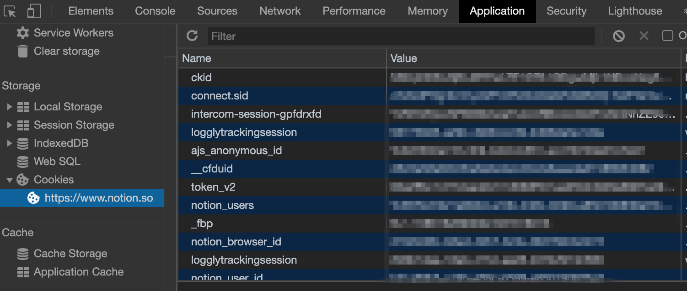
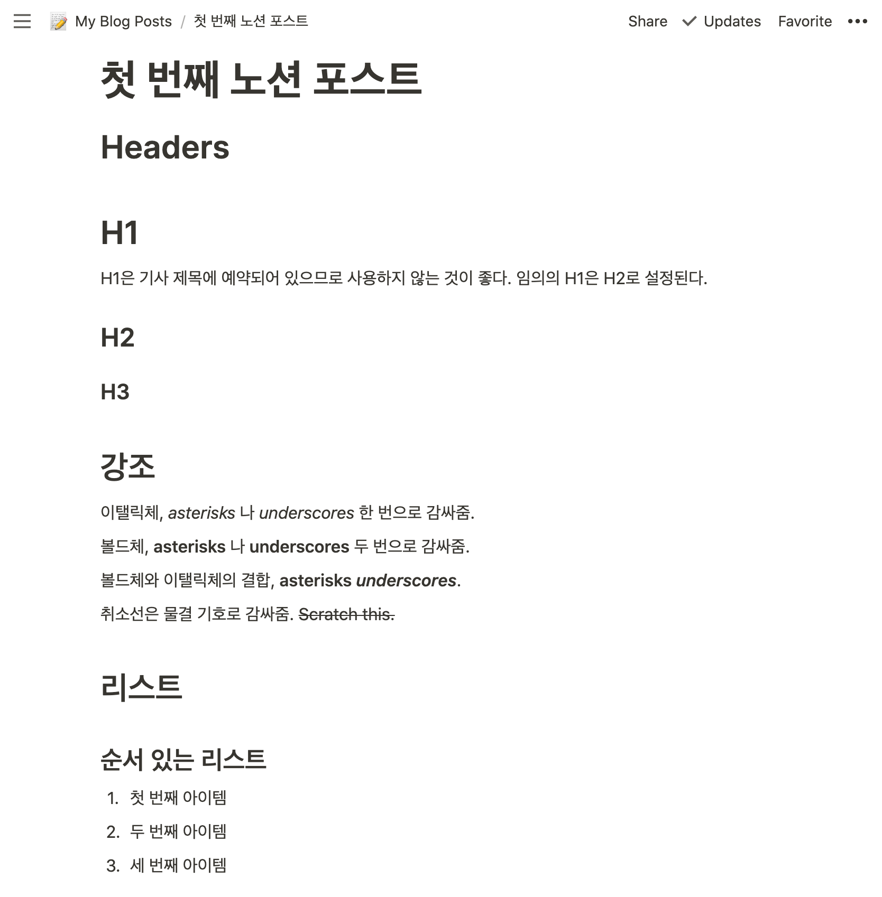
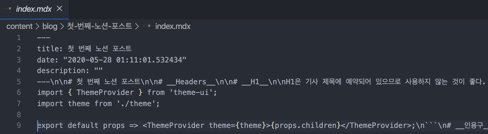
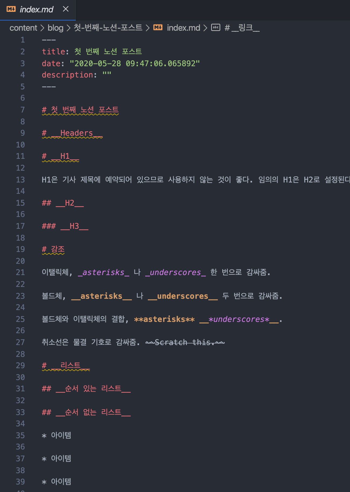

## 들어가며 - 나의 블로그 실패기

매번 **"블로그를 멋지게 꾸미고, 꾸준히 글을 작성해야지!"** 하고 다짐했지만 항상 실패했다. 그럴 때마다 애꿎은 블로그 서비스를 탓했다.

- 네이버 블로그는 구글에 검색이 안되고 저품질로 빠질 우려가...

- 티스토리는 디자인이 거기서 거기라...

- Jekyll은 커스텀하기 귀찮아서...

- ~~velog는 ... 다 쓰니까?~~

> 위의 사항은 핑계고 모두 훌륭한 블로그 서비스이다

그러던 중 노션을 알게 됐고, 노션을 블로그로 활용하는 몇몇 사례를 보게 되었다. 미니멀하고 깔끔한 디자인에, 글 작성 경험이 좋은 노션을 나도 블로그로 사용해볼까 고민하기 시작했다.

## 노션 블로그의 단점

멋진 노션 블로그에 빠져 나름대로 [노션 블로그](https://www.notion.so/younho9-Blog-9ed630c8603541bab20662b4854a891f)를 만들어봤다.

포스트마다 [hits](https://hits.seeyoufarm.com/)를 붙이고, 데이터베이스 기능을 활용해 블로그 글을 상태별로 관리하면서 **완벽한 블로그 솔루션을 찾은 듯**했다.

그런데 노션 콘텐츠의 SEO가 좋지 않았다. Share to the web을 켜놓아도 이 링크가 다른 웹 사이트에 공유되었을 때 구글에 검색되기 시작하는 것 같았다.


> 당근마켓 팀 노션 페이지가 구글 검색에 노출이 잘되는 이유

그리고 노션엔 댓글 기능이 없었다. 물론 검색도 안되는 글에 댓글이 달릴리 없겠지만, 댓글을 달 수 없는 블로그는 절반의 기능이 빠진 느낌이었다.

> 절대로 나만 볼 글을 정성스레 작성할 리 없다.

### 단점 극복 방법들

노션 유저 그룹에는 노션 블로그의 단점들을 극복하기 위한 많은 방법들이 공유되고 있다.

🔗 [https://www.sungchulblog.com/How-to-set-up-Notion-as-Blog-Tutorial-a9dbb28cf2db4db8a54e71ee14f42c98](https://www.sungchulblog.com/How-to-set-up-Notion-as-Blog-Tutorial-a9dbb28cf2db4db8a54e71ee14f42c98)

🔗 [Joey: Extension block for notion](https://joeynotion.com/)

🔗 [노션에서 구글 애널리틱스 사용하기](http://blog.mskim.me/posts/google-analytics-with-notion-so/?fbclid=IwAR1Gv0Lq8b94CbFi-8u3p8LOc5YaDuAfIHZvMslQsSpAbaOLwUeUv1RB-Rw)

노션에 disqus를 추가하는 방법, 도메인 네임을 변경하는 방법, 노션에 소셜 댓글 블락을 추가하는 방법, 그리고 페이지 조회수를 추적하기 위한 구글 애널리틱스 추가 방법 등이 있었다.

> 이러한 방법들을 찾아내고 만드신 분들이 대단하다는 생각과 함께 동시에 노션 서비스의 힘에 대해서도 생각하게 되었다. **훌륭한 서비스와 훌륭한 유저 커뮤니티.**

하지만 아쉽게도 위의 방법을 사용하는 것을 포기했다. **노션은 블로그 플랫폼이 아니기 때문에**, 블로그로 사용하기 위해 확장을 붙이는 것이 내 기준에선 불편하게 느껴졌다. 물론 각자의 취향과 목적에 맞게 충분히 블로그처럼 사용할 수 있다고 생각한다.

## 노션을 CMS로

그래서 다른 블로그 서비스를 알아보던 중, 흥미로운 글을 발견했다. [notion-py](https://github.com/jamalex/notion-py) 라는 비공식 파이썬 API를 사용해서 **노션을 블로그의 CMS로 사용하는 방법**을 소개한 글이다.

🔗 [How I Use Notion As My CMS For My Gatsby Site](https://medium.com/@tfaieta/how-i-use-notion-as-my-cms-for-my-gatsby-site-c449cc9a4687)

> CMS(Contents Management System) - 콘텐츠를 플랫폼에 의존하지 않고 관리할 수 있는 시스템.
> 블로그 플랫폼이 없어지더라도 내 콘텐츠를 보존할 수 있다. 또한 CMS의 CRUD(생성, 읽기, 수정, 삭제)가 블로그와 동기화된다.

🔗 [Headless CMS, 머리가 없는 컨텐츠 관리 시스템](https://nacyot.tumblr.com/post/144544116444/headless-cms-%EB%A8%B8%EB%A6%AC%EA%B0%80-%EC%97%86%EB%8A%94-%EC%BB%A8%ED%85%90%EC%B8%A0-%EA%B4%80%EB%A6%AC-%EC%8B%9C%EC%8A%A4%ED%85%9C)

즉, 노션으로 블로그에 글을 작성하고, 수정하고, 삭제할 수 있게 되는 것이다! 흥미를 느끼고 해당 글을 따라 **노션 CMS를 구축**해보고 나에게 맞게 환경설정해봤다.

### Python3 설치, notion 모듈 설치

먼저 notion-py를 실행하기 위해서 파이썬을 설치해야한다.

🔗 [Download Python](https://www.python.org/downloads/)

파이썬 설치가 완료되면 `pip install notion` 명령어로 notion-py 모듈을 설치한다.

### 노션 페이지 준비하기

노션에선 **한 페이지 안에 여러 자식 페이지가** 있을 수 있다. 위의 글에서 소개한 파이썬 코드는 notion-py를 활용하여 한 페이지 안에 있는 여러 자식 페이지를 `mdx` 파일로 가져오는 코드이다.


위와 같은 노션 페이지가 있다고 할 때, 안에 있는 자식 페이지들을 가져오기 위해 두 가지가 필요하다. **노션 계정에 부여된** **`token_v2`** 와 **페이지의** **`url`** 이다.

페이지 `url` 은 주소창에서 그대로 가져오면 되고, `token_v2`는 크롬에서 `개발자도구(F12) > Application > Storage > Cookies > https://www.notion.so...` 에서 `token_v2` 의 `Value` 를 가져오면 된다.



### 코드 실행하기

가져온 `token_v2` 는 아래 코드의 `"NOTION_TOKEN"` 위치에 넣고, 노션 페이지의 `url` 은 `"NOTION_BLOG_POSTS_PAGE"` 위치에 넣는다.

> ☝️ `token_v2` 는 계정마다 부여된 고유값이므로 공유하지 말 것

````python
# get_blog_posts.py

import os
import datetime
from notion.client import NotionClient
client = NotionClient(token_v2="NOTION_TOKEN")
blog_home = client.get_block("NOTION_BLOG_POSTS_PAGE")

# Main Loop
for post in blog_home.children:
    # Handle Frontmatter
    text = """---
title: %s
date: "%s"
description: ""
---""" % (post.title, datetime.datetime.now())
    # Handle Title
    text = text + '\\n\\n' + '# ' + post.title + '\\n\\n'
    for block in post.children:
        # Handles H1
        if (block.type == 'header'):
            text = text + '# ' + block.title + '\\n\\n'
        # Handles H2
        if (block.type == 'sub_header'):
            text = text + '## ' + block.title + '\\n\\n'
        # Handles H3
        if (block.type == 'sub_sub_header'):
            text = text + '### ' + block.title + '\\n\\n'
        # Handles Code Blocks
        if (block.type == 'code'):
            text = text + '```\\n' + block.title + '\\n```\\n'
        # Handles Images
        if (block.type == 'image'):
            text = text + '\\n\\n'
        # Handles Bullets
        if (block.type == 'bulleted_list'):
            text = text + '* ' + block.title + '\\n'
        # Handles Dividers
        if (block.type == 'divider'):
            text = text + '---' + '\\n'
        # Handles Basic Text, Links, Single Line Code
        if (block.type == 'text'):
            text = text + block.title + '\\n'
    title = post.title.replace(' ', '-')
    title = title.replace(',', '')
    title = title.replace(':', '')
    title = title.replace(';', '')
    title = title.lower()
    try:
        os.mkdir('../content/blog/' + title)
    except:
        pass
    file = open('../content/blog/' + title + '/index.mdx', 'w')
    print('Wrote A New Page')
    print(text)
    file.write(text)
````

> 출처 : [https://medium.com/@tfaieta/how-i-use-notion-as-my-cms-for-my-gatsby-site-c449cc9a4687](https://medium.com/@tfaieta/how-i-use-notion-as-my-cms-for-my-gatsby-site-c449cc9a4687)

이 코드는 노션에 있는 글을 `mdx` 파일로 추출하여 저장하는데, 이 코드는 다음의 폴더 구조를 가정한다.

```plain text
.
├── content
│  └── blog
│    └── 이 위치에 글이 저장된다.
└── notion
   └── get_blog_posts.py
```

이 폴더 구조를 만들고 notion 폴더로 이동해 파이썬 코드를 실행하면, 해당 노션 페이지에 있는 자식 페이지가 `mdx` 파일로 추출된다.

```bash
python get_blog_posts.py
```





노션에 있는 포스트를 `mdx` 파일로 가져오는데 성공했다. Jekyll, Gatsby 등 마크다운을 지원하는 블로그의 포스트에 들어가는 헤더 데이터도 삽입할 수 있었다.

### 간단히 코드 수정하기

간단하게 코드를 수정하면 노션 글 내부의 각 블록 요소들을 개행으로 구분하고, `mdx` 파일이 아닌 `md` 파일로 글을 저장할 수 있다.

````python
# get_blog_posts.py

import os
import datetime
from notion.client import NotionClient
client = NotionClient(token_v2="NOTION_TOKEN")
blog_home = client.get_block("NOTION_BLOG_POSTS_PAGE")

# Main Loop
for post in blog_home.children:
    # Handle Frontmatter
    text = """---
title: %s
date: "%s"
description: ""
---""" % (post.title, datetime.datetime.now())
    # Handle Title
    text = text + '\n\n' + '# ' + post.title + '\n\n'
    for block in post.children:
        # Handles H1
        if (block.type == 'header'):
            text = text + '# ' + block.title + '\n\n'
        # Handles H2
        if (block.type == 'sub_header'):
            text = text + '## ' + block.title + '\n\n'
        # Handles H3
        if (block.type == 'sub_sub_header'):
            text = text + '### ' + block.title + '\n\n'
        # Handles Code Blocks
        if (block.type == 'code'):
            text = text + '```\n' + block.title + '\n```\n'
        # Handles Images
        if (block.type == 'image'):
            text = text + '\n\n'
        # Handles Bullets
        if (block.type == 'bulleted_list'):
            text = text + '* ' + block.title + '\n\n'
        # Handles Dividers
        if (block.type == 'divider'):
            text = text + '---' + '\n\n'
        # Handles Basic Text, Links, Single Line Code
        if (block.type == 'text'):
            text = text + block.title + '\n\n'
    title = post.title.replace(' ', '-')
    title = title.replace(',', '')
    title = title.replace(':', '')
    title = title.replace(';', '')
    title = title.lower()
    try:
        os.mkdir('../content/blog/' + title)
    except:
        pass
    file = open('../content/blog/' + title + '/index.md', 'w')
    print('Wrote A New Page')
    print(text)
    file.write(text)
````



개행이 된 마크다운 문서로 추출되니 훨씬 깔끔해보인다!

## 마치며

이렇게 노션 페이지에 있는 하위 페이지들을 가져오는데 성공했다. 하지만 아직 아쉬운 점들이 있다.

- 노션의 모든 블록 타입을 처리하지 못한다.

- 코드 블록의 언어지정이 마크다운에 적용되지 않는다.

- 그리고 노션의 페이지를 CMS로 사용하는 것은 불편하다.

다음 글에서는 이러한 아쉬운 점들을 개선하고, 본격적으로 노션을 CMS로 활용하기 위해 노션 데이터베이스를 활용하는 방법을 알아볼 것이다.

## 참고자료

🔗 [Introducing notion-py, an unofficial Python API wrapper for Notion.so](https://medium.com/@jamiealexandre/introducing-notion-py-an-unofficial-python-api-wrapper-for-notion-so-603700f92369)

🔗 [Powering a blog with Notion and Netlify](https://blog.kowalczyk.info/article/a8cf04d756ec4963905960822b004440/powering-a-blog-with-notion-and-netlify.html)
