이전 글에서 notion-py를 사용해 노션에 페이지에 있는 블로그 포스트들을 마크다운 문서로 추출하는 방법까지 사용해봤다. 하지만 본격적으로 노션을 CMS로 사용하기 위해서 **노션의 강력한 데이터베이스 기능**을 활용하려고 한다.

## 노션 데이터베이스 활용하기

이전 방식처럼 한 페이지 안에 블로그 포스트들을 단순히 모아놓는 것은 여러모로 불편하다. 포스트의 제목만 보이기 때문에, 언제 작성했는지, 무슨 주제인지 쉽게 파악하기 어렵다.

노션은 다양한 콘텐츠를 관리할 수 있는 강력한 데이터베이스 기능을 제공하는데, 이를 활용하면 블로그 포스트도 쉽게 관리할 수 있다.

다양한 프로퍼티를 사용해 작성 날짜, 상태, 태그, 작성자 등 **블로그 포스트에 필요한 헤더 데이터를 구성**할 수 있다.

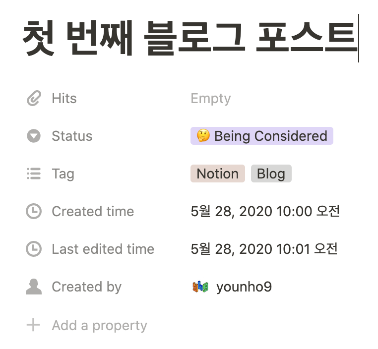

그리고 노션 데이터베이스는 이러한 프로퍼티들을 활용해서 **필터링하고 정렬하는 기능을 지원**하며, 테이블, 보드, 캘린더 등 다양한 뷰를 지원하기 때문에 콘텐츠들을 쉽게 파악할 수 있다.

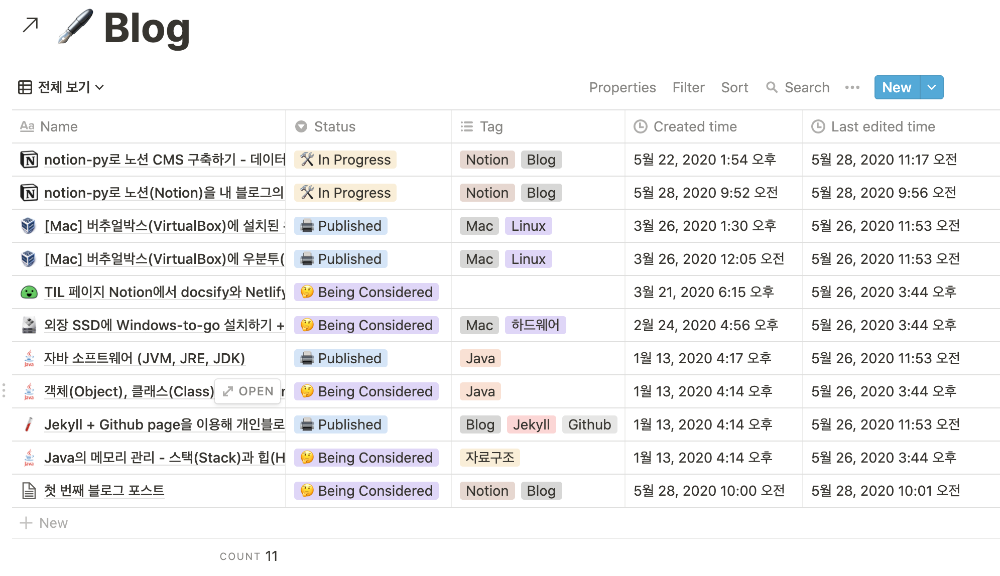

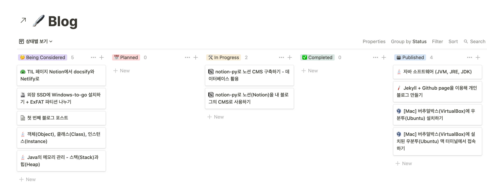

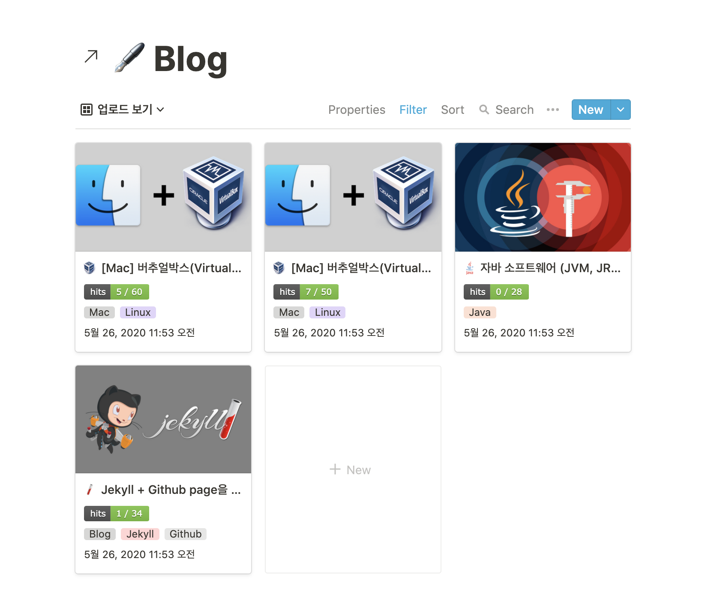

### 링크드 데이터베이스 (Linked database)

노션에는 링크드 데이터베이스라는 개념이 있다. 노션에서 데이터베이스는 인라인 또는 풀페이지로 만들 수 있는데, 이렇게 만든 원본 데이터베이스를 **"링크"하여 다른 페이지 안에 넣거나, 자체 페이지로 만드는 것**이 가능하다.

원본 데이터베이스와 링크드 데이터베이스는 **같은 데이터베이스로, 데이터가 완전히 동기화**된다.

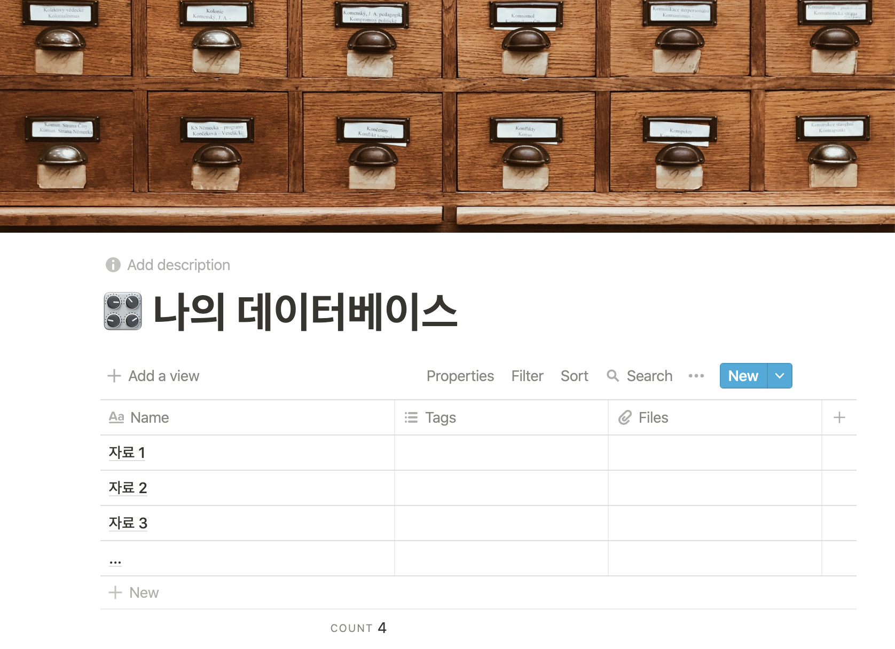

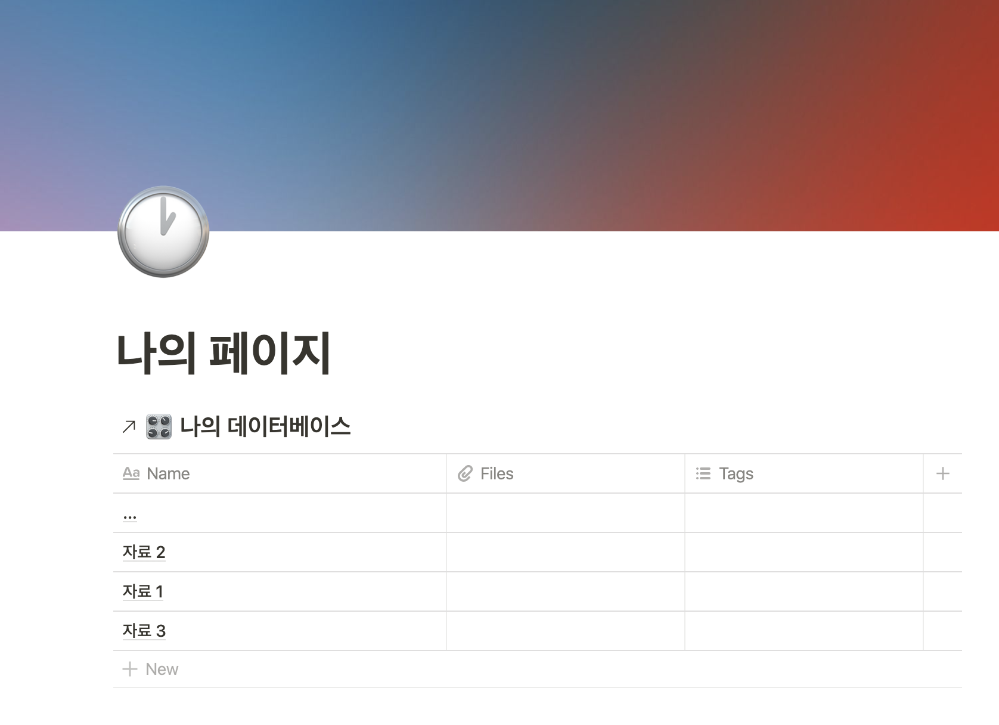

> 원본 데이터베이스와 페이지에 삽입한 링크드 데이터베이스. 왼쪽의 ↗화살표가 보인다.

## 본격적인 CMS 구축

이렇게 강력한 노션의 데이터베이스 기능을 활용하여 본격적으로 **노션 CMS를 구축**해보자.

먼저 노션에 블로그 포스트를 관리할 데이터베이스를 만든다. 이 데이터베이스에 다양한 속성과 뷰를 추가하여 각자의 방식으로 블로그 CMS를 만들 수 있다.

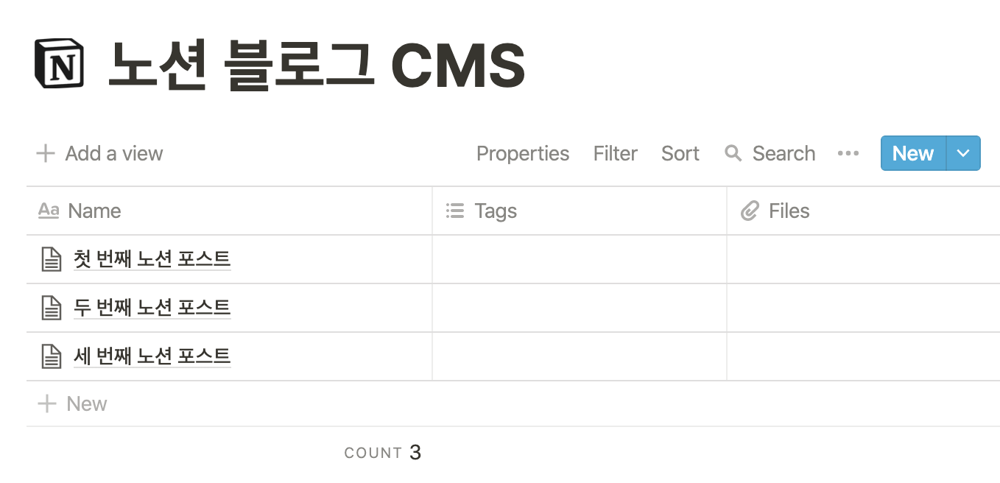

그리고 빈 페이지를 하나 만들어, 이 데이터베이스의 링크드 데이터베이스를 인라인으로 추가한다.

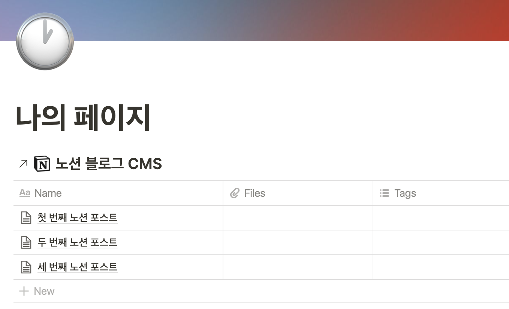

왼쪽 사이드바에 있는 데이터베이스를 우클릭하여 링크를 복사하고 페이지에 붙여넣기하면 링크드 데이터베이스가 삽입된다.

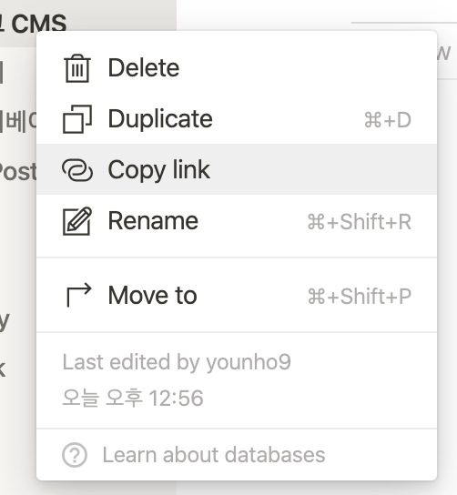

### 데이터베이스 `id` 구하기

위에서 링크드 데이터베이스를 페이지에 삽입한 것은 데이터베이스의 `id` 를 구하기 위해서였다.

> 🙇‍♂️ 더 좋은 방법이 있다면 알려주시기 바랍니다.

이전 글의 코드에서는 **페이지의** **`url`** **로 접근해 페이지 내의 포스트에 접근**한 것이다. 하지만 데이터베이스에 있는 포스트를 가져오기 위해서는 **페이지의** **`url`** **이 아니라 데이터베이스의** **`id`** 가 필요하다.

**원본 데이터베이스와 링크드 데이터베이스는 동일한** **`id`** **를 가지므로** 이전에 작성한 코드를 활용하면 데이터베이스 `id` 를 구할 수 있다.

데이터베이스의 `id` 는 아래의 방법으로 구할 수 있다. `token_v2` 는 자신의 `token_v2` 그대로 사용하면 되고, **링크드 데이터베이스 블럭을 포함하고 있는 페이지의** **`url`** **을 넣어**, 페이지 안에 있는 블럭들을 출력해보면, 블럭의 `id` , 데이터베이스의 제목, 데이터베이스( `collection` )의 `id` 가 출력된다.

```python
# get_database_id.py

from notion.client import NotionClient

client = NotionClient(token_v2="NOTION_TOKEN")
page = client.get_block("NOTION_PAGE_URL")

for block in page.children:
    print(block)
```

```bash
python get_database_id.py
```

```plain text
id='f24dc957-257d-4c64-b702-6941caa90a2a', title='노션 블로그 CMS', collection=<Collection (id='e3045ea9-f535-4dea-917c-c6145e9349b0')>
```

이 코드를 실행해보면, `block` 의 `id` 와 `collection` 즉, 데이터베이스의 타이틀과 `id` 를 출력한다. 이 `collection` 의 `id` 를 사용해서 데이터베이스에 접근할 수 있다.

### 데이터베이스의 포스트에 접근하기

이제 데이터베이스에 접근해 글을 가져오도록 코드를 수정하자. notion-py에서는 `get_collection(collection_id)` 로 데이터베이스가 갖고 있는 정보들을 가져올 수 있고, `collection.get_rows()` 를 사용해 데이터베이스 각 행에 있는 포스트에 접근할 수 있다.

```python
# get_posts_from_database.py

from notion.client import NotionClient

client = NotionClient("NOTION_TOKEN")
contents_collection = client.get_collection("COLLECTION_ID")
posts = contents_collection.get_rows()

for post in posts:
    print(post)
```

```python
python get_posts_from_database.py
```

```plain text
id='5bec41c9-b09b-49a4-9945-69fb946105d4', title='첫 번째 노션 포스트'
id='8aa224bd-6c46-4c97-b4c5-c0e1b28256f4', title='두 번째 노션 포스트'
id='6c422bef-fe9b-4f73-86bd-c65e915ac136', title='세 번째 노션 포스트'
```

이제 이렇게 접근한 포스트의 내용을 가져오는 코드를 작성하면 된다.

````python
# get_posts_from_database.py

import os
import datetime

from notion.client import NotionClient

client = NotionClient("NOTION_TOKEN")
contents_collection = client.get_collection("COLLECTION_ID")
posts = contents_collection.get_rows()

for post in posts:
    # Handle Frontmatter
    text = """---
title: %s
date: "%s"
description: ""
---""" % (post.title, datetime.datetime.now())
    # Handle Title
    text = text + '\n\n' + '# ' + post.title + '\n\n'
    for block in post.children:
        # Handles H1
        if (block.type == 'header'):
            text = text + '# ' + block.title + '\n\n'
        # Handles H2
        if (block.type == 'sub_header'):
            text = text + '## ' + block.title + '\n\n'
        # Handles H3
        if (block.type == 'sub_sub_header'):
            text = text + '### ' + block.title + '\n\n'
        # Handles Code Blocks
        if (block.type == 'code'):
            text = text + '```\n' + block.title + '\n```\n'
        # Handles Images
        if (block.type == 'image'):
            text = text + '\n\n'
        # Handles Bullets
        if (block.type == 'bulleted_list'):
            text = text + '* ' + block.title + '\n\n'
        # Handles Dividers
        if (block.type == 'divider'):
            text = text + '---' + '\n\n'
        # Handles Basic Text, Links, Single Line Code
        if (block.type == 'text'):
            text = text + block.title + '\n\n'
    title = post.title.replace(' ', '-')
    title = title.replace(',', '')
    title = title.replace(':', '')
    title = title.replace(';', '')
    title = title.lower()
    try:
        os.mkdir('../content/blog/' + title)
    except:
        pass
    file = open('../content/blog/' + title + '/index.md', 'w')
    print('Wrote A New Page')
    print(text)
    file.write(text)
````

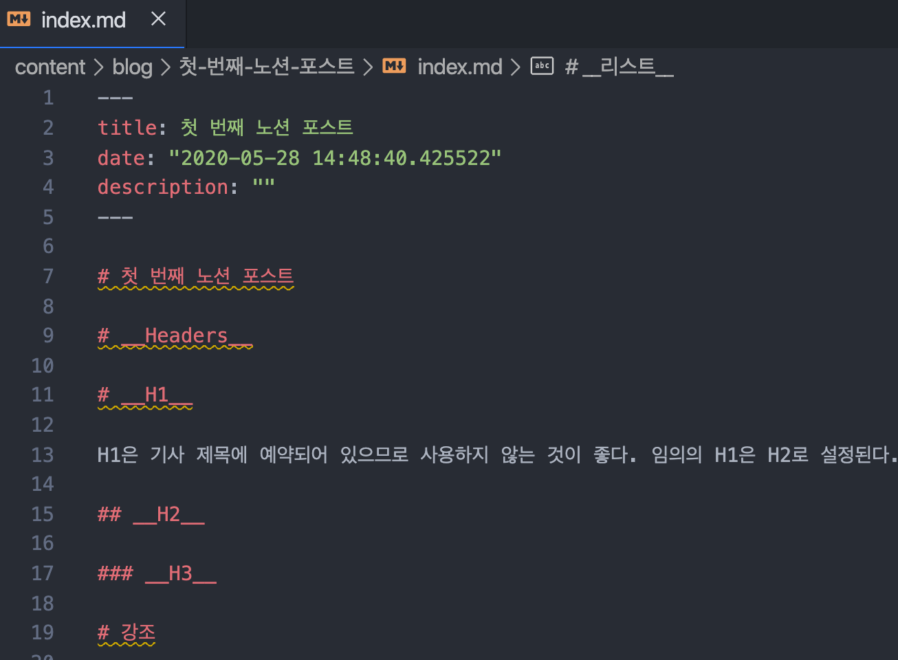

### 데이터베이스의 `property` 가져오기

데이터베이스에서 지정한 속성들 역시 가져와 활용할 수 있다. 예를 들어 작성 완료된 포스트만 가져온다거나, 포스트의 작성 날짜나 태그들을 가져와 헤더데이터로 사용하는 등으로 활용할 수 있다.

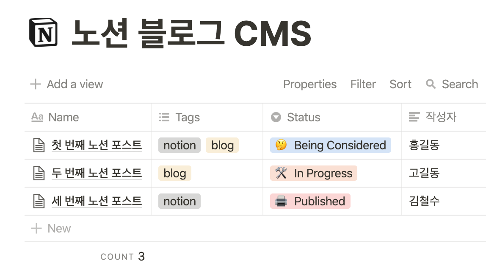

```python
# get_database_properties.py

import os
import datetime

from notion.client import NotionClient

client = NotionClient("NOTION_TOKEN")
contents_collection = client.get_collection("COLLECTION_ID")
properties = contents_collection.get_schema_properties()

for property in properties:
    print(property)
```

데이터베이스가 갖고 있는 속성들의 목록은 `collection` 의 `get_schema_properties()` 를 사용하여 확인할 수 있다.

이 `property` 들은 데이터베이스 안에 있는 각각의 포스트가 갖고 있다. `post.status` , `post.tags` 등 아래에서 `slug` 의 값으로 포스트의 `property` 에 접근할 수 있다.

```plain text
# 제목
{'id': 'title', 'slug': 'name', 'name': 'Name', 'type': 'title'}
# 작성자
{'id': 'NP8D', 'slug': 'jagseongja', 'name': '작성자', 'type': 'text'}
# Status
{'id': 'E\\(M', 'slug': 'status', 'name': 'Status', 'type': 'select', 'options': [{'id': 'e274c30b-c1b0-4799-bc75-0284a69b874e', 'color': 'blue', 'value': '🤔 Being Considered'}, {'id': '820275ff-4729-4c44-bac6-dbbfd91d9669', 'color': 'orange', 'value': '🛠 In Progress'}, {'id': '12e040ea-0d36-47bb-a4e0-7c9c3576e9c9', 'color': 'red', 'value': '🖨 Published'}, {'id': '4b7f564e-4838-4562-96f1-435386232f1b', 'color': 'pink', 'value': '✅ Completed'}, {'id': 'baef00ae-0231-430b-8081-36944e0b5601', 'color': 'gray', 'value': '📅 Planned'}]}
# Tags
{'id': '+o>c', 'slug': 'tags', 'name': 'Tags', 'type': 'multi_select', 'options': [{'id': '41b97603-34d4-4e3a-88de-7804956575c7', 'color': 'gray', 'value': 'notion'}, {'id': '9f12d211-763b-4682-8054-26f9621c5b45', 'color': 'yellow', 'value': 'blog'}]}
```

> 🤔 신기하게도, **한글 속성은 발음대로 영어로 바뀌어 나타나는 것**을 발견했다.

이제 데이터베이스를 가져오고, 데이터베이스에서 포스트를 가져오고, 포스트가 갖고 있는 속성도 가져올 수 있다.

```python
# get_post_properties.py

import os
import datetime

from notion.client import NotionClient

client = NotionClient("NOTION_TOKEN")
contents_collection = client.get_collection("COLLECTION_ID")
posts = contents_collection.get_rows()

for post in posts:
    print(post.tags)
```

```plain text
$ python get_post_properties.py
['notion', 'blog']
['blog']
['notion']
```

## 추가 설정

### 머리말 구성

이렇게 가져온 속성들을 블로그 포스트의 머리말 데이터로 사용해보자.

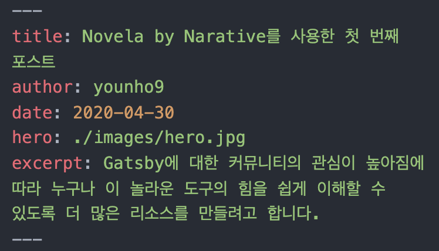

> `hero` : 썸네일 이미지
> `excerpt` : 요약 문구

내가 사용하고 있는 Gatsby 블로그에서는 이러한 머리말 데이터를 사용했다. 데이터베이스에 헤더를 위한 데이터들을 추가해주었다.

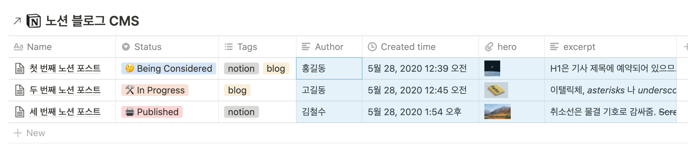

이제 각 속성의 `slug` 값으로 접근하여 머릿말에 추가하면 된다.

```python
import os
import datetime

from notion.client import NotionClient

client = NotionClient("NOTION_TOKEN")
contents_collection = client.get_collection("COLLECTION_ID")
posts = contents_collection.get_rows()

for post in posts:
    # Handle Frontmatter
    text = """---
title: %s
author: %s
date: "%s"
excerpt: %s
""" % (post.title, post.author, post.created_time.strftime("%Y-%m-%d"), post.excerpt)
    if not post.hero:
        text = text + '---\n\n'
    elif 'png' in post.hero[0]:
        text = text + 'hero: ' + './images/hero.png\n---\n\n'
        image_format = 'png'
    elif 'jpg' in post.hero[0]:
        text = text + 'hero: ' + './images/hero.jpg\n---\n\n'
        image_format = 'jpg'

    print(text)
```

여기서 `hero` 즉, 커버 이미지 파일에 대한 처리가 필요했다. 노션 데이터베이스 속성 중 `Files & media` 는 이미지와 파일 `url` 이 문자열로 담긴 배열을 사용하는데, `url` 에 있는 이미지 파일 형식자에 따른 처리를 해주었다.

이후에 이 이미지 링크에서 이미지를 `./image/hero.xxx` 경로에 다운받을 것이다.

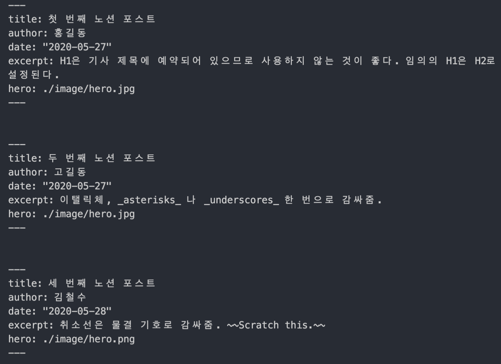

머릿말이 잘 구성되었다.

### 더 많은 노션 블록 타입 지원하기

이전 글의 코드에서는 다양한 노션 블록에 대한 지원이 부족했다.

여러 블록 타입에 대한 처리는 간단하게 `block.type` 으로 `type` 을 알아내고 `block.title` 로 접근해 내용을 가져올 수 있다.

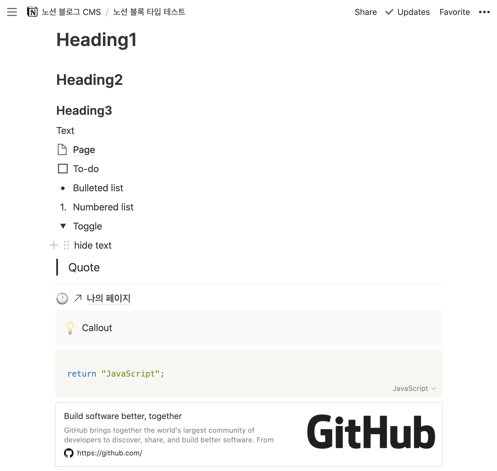

```python
for post in posts:
    # Handle Frontmatter
    text = """---
title: %s
author: %s
date: "%s"
excerpt: %s
""" % (post.title, post.author, post.created_time.strftime("%Y-%m-%d"), post.excerpt)
    if not post.hero:
        text = text + '---\n\n'
    elif 'png' in post.hero[0]:
        text = text + 'hero: ' + './images/hero.png\n---\n\n'
        image_format = 'png'
    elif 'jpg' in post.hero[0]:
        text = text + 'hero: ' + './images/hero.jpg\n---\n\n'
        image_format = 'jpg'

    # Handle Title
    text = text + '\n\n' + '# ' + post.title + '\n\n'
    for block in post.children:
        print(block.type)
        print(block)
```

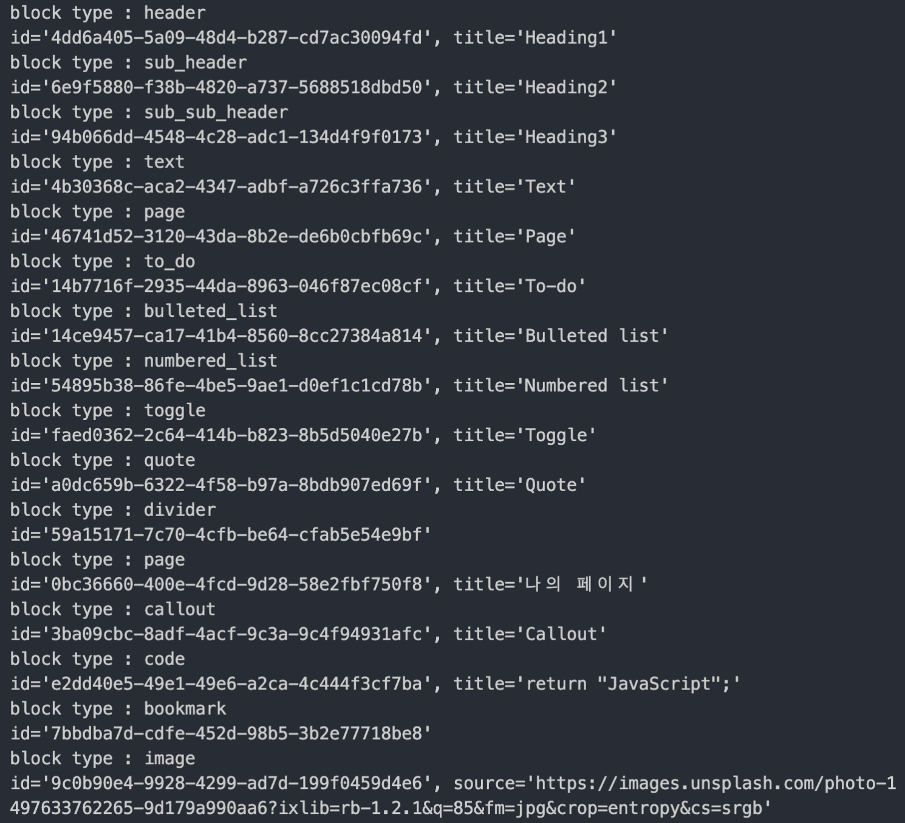

이렇게 하면 간단하게 `block` 의 타입 이름과 `title` 에 어떤 내용이 담기는지 볼 수 있었다.

🔗 [jamalex/notion-py](https://github.com/jamalex/notion-py/blob/master/notion/block.py)

`block` 타입 별로 어떤 추가적인 속성을 가지는지는 위의 소스를 보면 알 수 있다.

예를 들어 `callout` 블럭은 `icon` 속성을 갖고, `code` 블럭은 `language` 속성을 갖고, `bookmark` 블럭은 `link` , `bookmark_cover` 등의 속성을 갖는다.

이런 속성들을 활용하면 보다 정확하게 노션 블로그 글을 가져올 수 있다.

> 심지어 노션 자체 마크다운 export 기능은 언어 지정이 반영되지 않는데 language 속성으로 이를 가능하게 할 수 있다.

````python
for post in posts:
    # Handle Frontmatter
    text = """---
title: %s
author: %s
date: "%s"
excerpt: %s
""" % (post.title, post.author, post.created_time.strftime("%Y-%m-%d"), post.excerpt)
    if not post.hero:
        text = text + '---\n\n'
    elif 'png' in post.hero[0]:
        text = text + 'hero: ' + './images/hero.png\n---\n\n'
        image_format = 'png'
    elif 'jpg' in post.hero[0]:
        text = text + 'hero: ' + './images/hero.jpg\n---\n\n'
        image_format = 'jpg'

    # Handle Title
    text = text + '# ' + post.title + '\n\n'
    for block in post.children:
        # Handles H1
        if (block.type == 'header'):
            text = text + '# ' + block.title + '\n\n'
        # Handles H2
        if (block.type == 'sub_header'):
            text = text + '## ' + block.title + '\n\n'
        # Handles H3
        if (block.type == 'sub_sub_header'):
            text = text + '### ' + block.title + '\n\n'
        # Handles Code Blocks
        if (block.type == 'code'):
            text = text + '```' + block.language.lower() + '\n' + block.title + '\n```\n\n'
        # Handles Callout Blocks
        if (block.type == 'callout'):
            text = text + '> ' + block.icon + ' ' + block.title + '\n\n'
        # Handles Quote Blocks
        if (block.type == 'quote'):
            text = text + '> ' + block.title + '\n\n'
        # Handles Bookmark Blocks
        if (block.type == "bookmark"):
            text = text + "🔗 [" + block.title + "](" + block.link + ")\n\n"
        # Handles Images
        if (block.type == 'image'):
            text = text + '\n\n'
        # Handles Bullets
        if (block.type == 'bulleted_list'):
            text = text + '* ' + block.title + '\n\n'
        # Handles Dividers
        if (block.type == 'divider'):
            text = text + '---' + '\n\n'
        # Handles Basic Text, Links, Single Line Code
        if (block.type == 'text'):
            text = text + block.title + '\n\n'
````

`callout`, `code`, `bookmark`, `quote` 에 대한 코드를 추가했다. 더 많은 코드는 계속 추가할 예정이다.

### 커버 이미지 다운받기

앞서 데이터베이스의 `hero` 속성에 추가한 `cover` 이미지를 다운받자.

```python
...
import urllib.request

...

for post in posts:

    ...

    # Make blog post directory
    title = post.title.replace(' ', '-')
    title = title.replace(',', '')
    title = title.replace(':', '')
    title = title.replace(';', '')
    title = title.lower()

    try:
        os.mkdir('../content/blog/' + title)
    except:
        pass

    # Handles post cover Image
    if post.hero:
        try:
            os.mkdir('../content/blog/' + title + '/images')
        except:
            pass
        if 'png' in post.hero[0]:
            urllib.request.urlretrieve(post.hero[0], "../content/blog/" + title + "/images/hero.png")
        elif 'jpg' in post.hero[0]:
            urllib.request.urlretrieve(post.hero[0], "../content/blog/" + title + "/images/hero.jpg")

    file = open('../content/blog/' + title + '/index.md', 'w')
    print('Wrote A New Page')
    print(text)
    file.write(text)
```

포스트 제목에 따라 폴더를 만들고, 포스트 폴더 안에 `images` 폴더에 `hero` 이미지를 `urllib.request` 를 사용해 다운받았다. 자세한 사용 방법은 아래 링크를 참고하자.

🔗 [urllib 패키지를 사용하여 인터넷 리소스를 가져오는 방법 - 파이썬 설명서 주석판](https://python.flowdas.com/howto/urllib2.html)

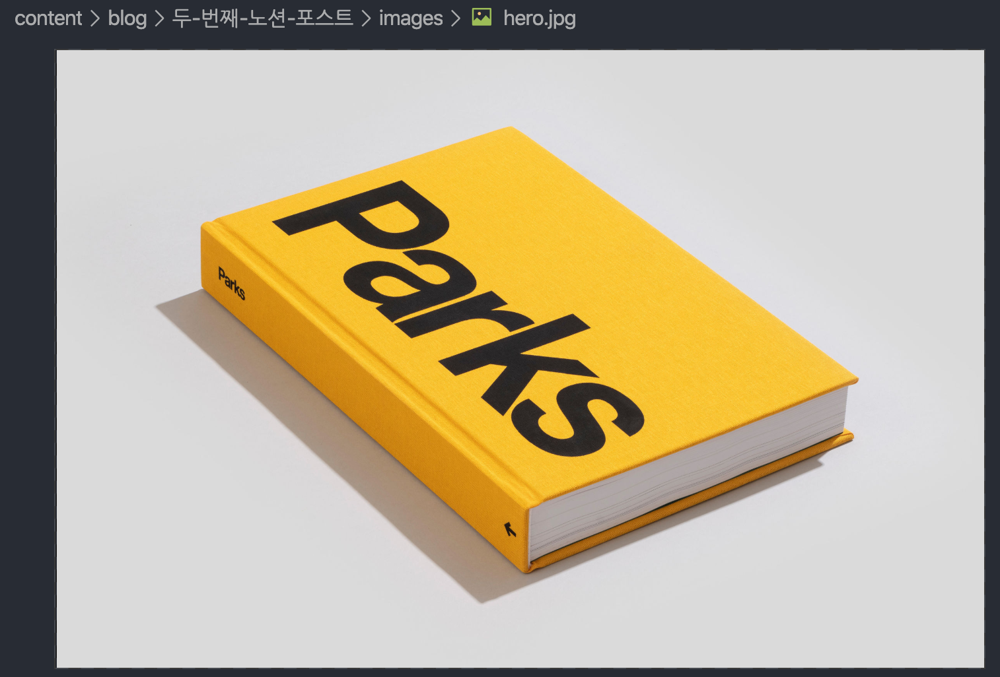

원하는 위치에 이미지를 저장했다. 머리말에 `hero` 의 경로가 지정되어 있으므로 Gatsby 블로그에서는 이 이미지를 가져와 커버로 사용할 것이다.

## 마치며

이렇게 notion-py를 활용하여 노션 데이터베이스에 있는 마크다운 문서들을 로컬로 가져왔다.

노션 데이터베이스를 활용하면 다양하게 뷰를 바꿔가며 콘텐츠를 확인할 수 있고, `sort`, `filter` 등의 기능을 활용할 수 있다. 또한 속성을 활용하여 글을 분류하고 관리하는 등 CMS로 활용할 수 있다.

물론 위의 코드는 마크다운 문서로 추출되기 때문에 마크다운을 지원하는 블로그 플랫폼이 아니라면 수정이 필요하다. 하지만 코드를 조금만 수정해도 어떤 블로그 플랫폼에 적용할 수 있다.

다음 글에서는

- os의 환경변수에 `token_v2` 를 등록하는 방법

- `config.py` 에 `collection_id` 를 저장하고 가져오는 방법

- [prettier](https://prettier.io/docs/en/cli.html)로 문서를 포맷팅한 후, 로컬 Gatsby 서버를 실행하는 쉘 스크립트를 작성하는 방법

- 노션 데이터베이스의 `status` 에 따라 콘텐츠를 필터링하여 가져오는 방법

- 노션에서 글 작성이 완료되었을 때 Github에 자동으로 업로드하는 방법

들을 다뤄볼 예정이다.

### notion-py는 비공식 노션 API이다

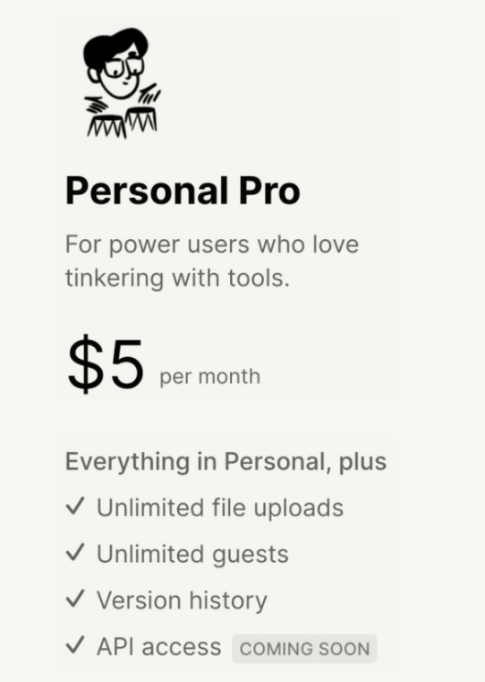

물론 notion-py가 "비공식" 노션 API이고, 노션에서는 곧 공식 API를 출시할 예정이라고 하기 때문에, 이 API를 언젠가 사용하지 못할 가능성이 있다.

하지만 notion-py를 다루며 **노션 공식 API가 가져올 어마어마한 가능성**에 대해 생각해 볼 수 있었다. 노션이 정말 **"All-In-One Workspace"** 가 될 수 있을까?

빠른 시일 내 공식 API가 출시되고 많은 유저들이 사용하면서 수많은 활용 예제들이 탄생하길 기대한다.
