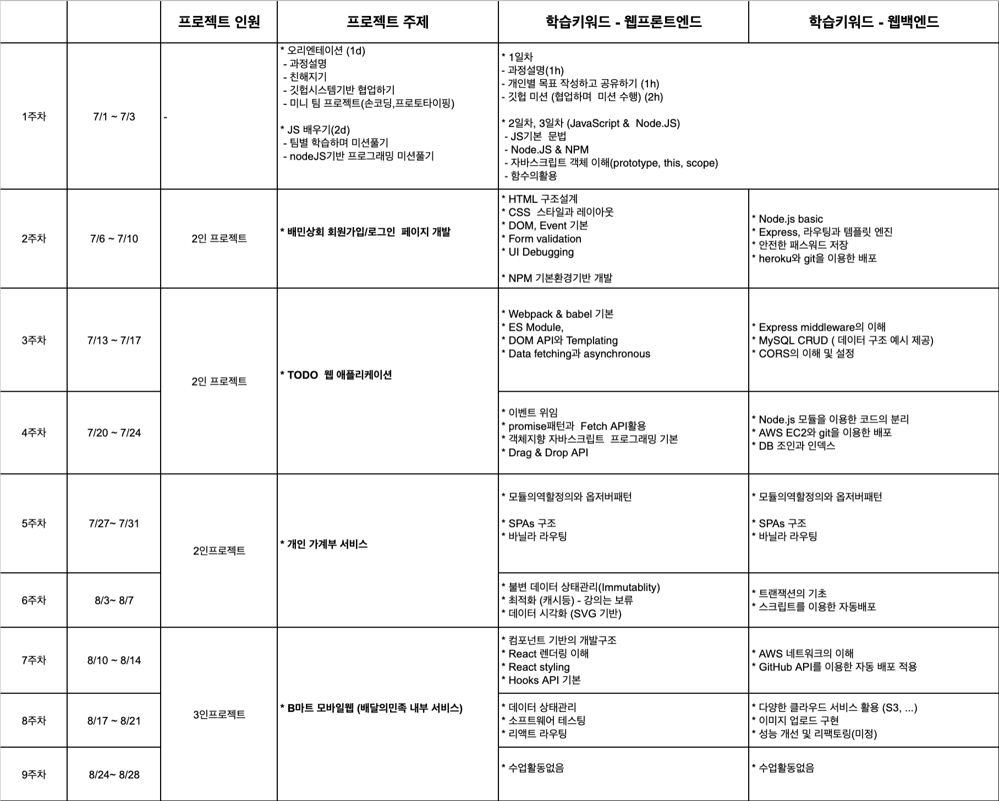
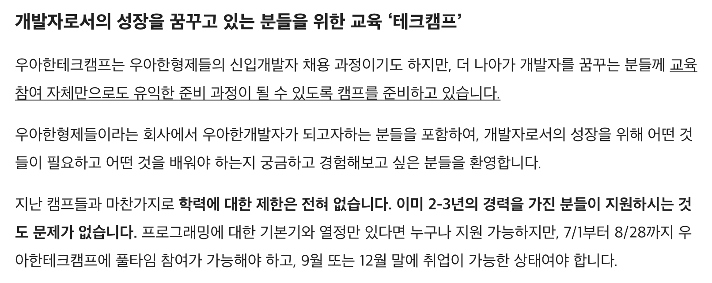
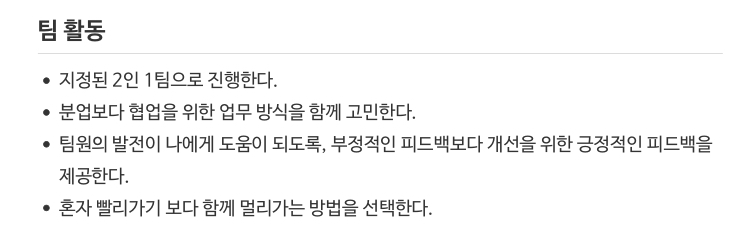

## 들어가며...

이번 주에 마무리한 우아한테크캠프 3-4주차 미션 중에는 블로그 포스트 작성 미션이 포함되어 있었다. 이번 프로젝트에서 경험한 기술에 대해서 다루는 것도 좋겠지만, 졸업 후 바로 우테캠에 참여하면서 정신 없었기 때문에 잠시 멈추고 뒤돌아볼 좋은 기회여서, 이 참에 회고를 쓰려고 한다.

그 동안 대학교 수업에만 의존하여 개발을 학습했던 나에게 우테캠은 **진짜 개발자**가 되기 위해 필요한 것이 무엇인지 느끼게 해줬다.

4주간 우테캠의 학습 방식을 되짚어보며 앞으로 찐-개발자가 되기 위해 어떻게 학습할지 생각해보려고 한다.

## 우아한테크캠프의 학습 방식

[[모집] 우아한테크캠프 3기 - 우아한형제들 기술 블로그](https://woowabros.github.io/devrel/2020/04/13/techcamp3.html)

> 우아한테크캠프 소개

우아한테크캠프에서의 학습 방식은 내게 익숙했던 학교에서의 학습 방식과 몇 가지 차이가 있었고, 이 학습 방식의 차이가 **진짜 개발자**로 성장하는데 큰 도움이 된다는 것을 느꼈다.

내가 느꼈던 학습 방식의 차이를 중심으로 글을 진행해보려고 한다.

### 모르는 것을 "알려주는" 수업 vs "모르는 것"을 알려주는 수업

우아한테크캠프에 합격하고 나서, 이 커리큘럼을 메일로 받았을 때 그 동안 학교에선 배울 수 없었던 실무에서 사용되는 기술들을 마스터 분들께 **가르침 받을** 생각에 설렜었다.

하지만 4주가 지난 지금 다시 커리큘럼을 보니 **학습키워드** 라는 말이 다시 보였다.

> 이 주제들은 대부분 스스로 학습해야 했던 것이다.

우테캠은 모르는 것을 **알려주는데** 초점이 맞춰져 있지 않다. 그저 내가 **모르는 새로운 학습 키워드가** 관련된 미션과 함께 주어진다.

미션이 주어지면, 팀원들과 함께 미션을 수행하면서 직접 부딪히며 학습한다. 처음에는 쏟아지는 학습 주제와 미션의 속도에 쫓아가기 바빴고, 모든 미션을 해결하지도 못했다.

하지만 4주가 지난 지금, 어느새 웹 애플리케이션의 설계부터 배포까지 어떻게 진행되는지를 이해하게 되었다.

다양한 학습 주제에 대해 하나하나 친절히 설명해주는 수업이었다면 이렇게 할 수 없었을 것이다.

학습해야 할 것이 무엇인지 알고, **스스로, 함께** 학습할 수 있는 환경 속에서 학습하는 것이 다양한 주제들을 빠르게 학습하기 위한 **최고의 방법이라는 것**을 우테캠에서 느끼게 되었다.

### 개발자로 취업하기 vs 개발자 되기

우아한테크캠프가 우아한형제들의 "신입개발자 채용 과정"이라는 점은 지원 동기의 큰 부분이었다.

> 실제로 캠프에서 간접적으로 우아한형제들의 문화를 경험하면서 더욱 가고 싶은 회사로 느껴졌다.

하지만 이 캠프는 우아한형제들 개발자가 되도록 가르치지 않는다. 팀 프로젝트와 코드 리뷰, 테크 세미나, 시니어 개발자와 주니어 개발자 Q&A ... 이러한 시간을 가지면서 스스로 좋은 개발자가 되기 위한 고민을 계속 하도록 해준다.

이 캠프를 통해서 나 자신도 단지 개발자로 취업을 하고 싶은 건지, 개발자로 살고 싶은 건지 되돌아보게 되었다.

그리고 평소 **판교 개발자**에 대한 낭만적 이미지를 갖고 있었던 나에게 개발자는 **평생 학습**해야 한다는 말의 무게에 대해 진지하게 고민해보게 만들었다.

### 경쟁 vs 협력

마지막으로 학교와 우테캠의 가장 큰 차이점은 학습의 동기 부여가 경쟁이 아닌 협력이라는 것이다.

내가 경험한 대부분의 학교 프로젝트는 적은 노력으로 최대 학점을 얻기 위한 눈치게임 같았다. 팀 안에서의 협력, 커뮤니케이션도 어려웠고, 다른 팀끼리는 서로 견제하기 바빴다.

하지만 우테캠에서는 팀 프로젝트의 결과물 퀄리티 보다는 함께 학습하고 함께 발전하는데 초점을 맞춘다.

스크럼을 통해 팀원의 컨디션도 파악하고, 회고를 통해 개선을 위한 긍정적 피드백도 제공한다.

또한 팀원간 학습한 내용, 문제 해결에 대해 공유하는 것을 넘어서 다른 팀과도 서로 주고받으며 함께 성장한다.

앞으로 개발자로서 **삽질의 경험**을 많이하게 될텐데, 같이 삽질할 사람이 있다는 것은 위안이 되는 것 같다.

## 마치며...

우아한테크캠프의 반바퀴를 돌며 학습 방식을 회고해봤다. 이미 전통적인 학습 방식이 자리잡아 우테캠의 학습 방식에 4주만에 적응하기는 쉽지 않았다.

특히 모르는 것도 너무 많고 주위에 잘하는 사람들이 너무 많아 멘탈을 관리하는 것도 쉽지 않다.

하지만 주니어 개발자 Q&A 시간을 통해 얻은 답변이 정말 인상적이었다

> Q: 알아야될 게 너무 많고 주변에 잘하는 사람이 많은데, 해줄 수 있는 조언이 있다면?

> A : 본인이 성장하기 위해 알아야할 것이 있고, 도움을 받을 수 있는 환경이기 때문에 좋은 환경이다. 비교하는 것은 좋지 않다. 코드를 잘짜는 것만이 개발자의 능력이 아니다. 자기의 장점, 주변 사람이 같이 일하고 싶은 동료가 되는게 중요하다.

남은 반바퀴를 돌고 나서 2달 전의 나와 비교해 조금 더 찐-개발자에 가까워져 있다면 좋겠다.
