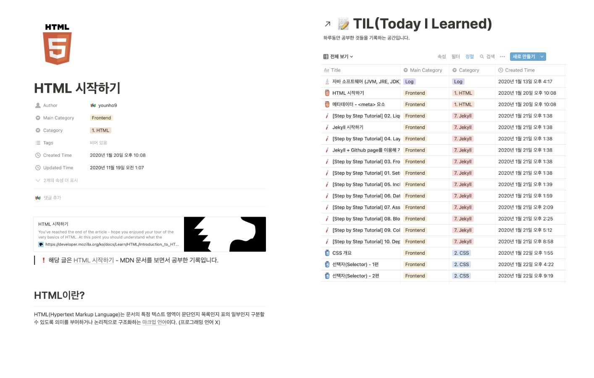
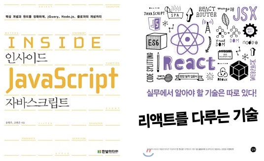
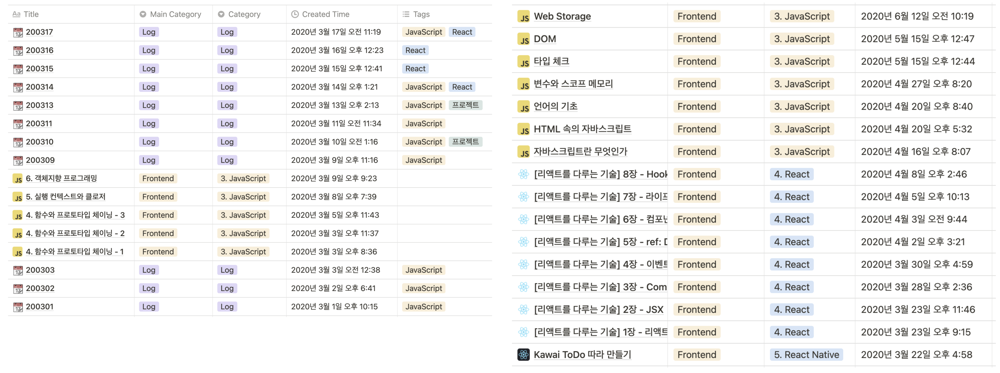
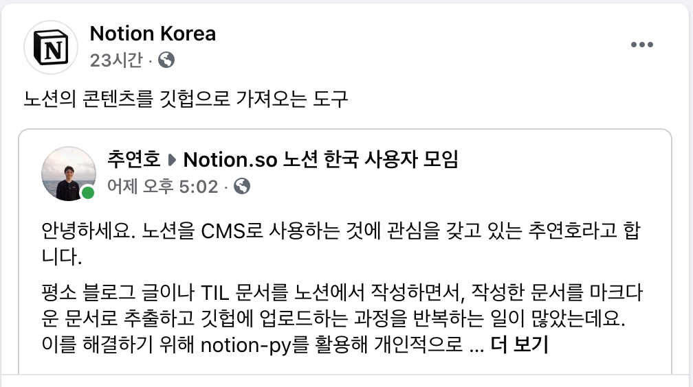

## Intro

### 목적

올해는 프론트엔드 공부를 시작하고, 우아한테크캠프와 이어진 취업 연계를 통한 면접들을 경험하면서 많이 성장했고, 장벽을 느끼기도 했던 한 해였다.

나는 올해를 어떻게 보냈는지 3가지 포인트로 되돌아보기로 한다.

- 기억에 남는 경험

- 노력했던 경험

- 아쉬웠던 경험

### 흥미와 적성

회고를 쓰기에 앞서서 올해 처음 프론트엔드 분야로 입문했는데, 자기소개서를 쓸 때나, 면접 시에 자주 물어보는 **"왜 프론트엔드 개발자로 지원했는가?"** 라는 질문에 대한 생각을 정리해본다.

고등학교 시절, 그림을 잘 그리는 편은 아니었지만 미술을 좋아했다. 하지만 수학/과학을 잘했던 나는 이공계로 진학했다.

대학교에서 미디어학과와 소프트웨어학과를 복수전공했는데, 비슷하게도 디자인 수업에 더 흥미를 느꼈지만, CS 수업의 성적이 더 좋았다.

물론 수학이나 CS 수업도 흥미가 없는 것은 아니었다. 수학 문제나 코딩 과제도 집중해서 해결했을 때의 즐거움이 있었다. 하지만 [dribbble](/e6b7e7f3134f47efbc618abe4334b130) 이나 [behance](https://www.behance.net/) 같은 사이트에 올라오는 디자인 작품들을 보면서 들었던 **"나도 저런 걸 만들고 싶다"**는 생각만큼은 아니었던 것 같다.

이렇게 흥미와 적성 사이에서 갈등하던 중 대학교 4학년이 되어서야 프론트엔드라는 분야를 알게 되었다. 먼저 웹 화면을 꾸미는 것이 너무 재밌었고, 또 나의 분석적이고 논리적인 면이 프로그래밍에서의 장점이 있다고 느꼈다.

이렇게 프로그래밍과 디자인, 두 분야 사이에서 갈팡질팡하던 중, 프론트엔드 분야가 내 흥미와 적성이 모두 맞을지도 모른다는 생각이 들었고 올해 1월부터 HTML, CSS를 공부하기 시작했다.

## 프론트엔드 공부 시작

### 노력했던 경험

1월부터 프론트엔드 공부를 시작했다. 생활코딩, 패스트캠퍼스 등등에서 HTML, CSS, JS 강의를 들으면서 공부한 내용을 노션에 정리하고 참고자료도 첨부하면서 기록하기 시작했다.

### 기억에 남는 경험

이 때는 [Jekyll](https://jekyllrb-ko.github.io/)을 사용해서 블로그를 꾸미는게 나름의 토이프로젝트였다. [Hux Blog](https://github.com/Huxpro/huxpro.github.io) , [http://jihyeleee.com/](http://jihyeleee.com/) 등의 테마가 맘에 들어서 적용해보고 조금씩 커스텀하면서 공부한 것을 적용했었다.

그러다가 [Gatsby](https://www.gatsbyjs.com/) 도 알게 되었는데, Jekyll보다 세련되고, 플러그인이 굉장히 많았다. 그렇게 Gatsby 테마를 찾아보다가 [novela](https://github.com/narative/gatsby-theme-novela) 라는 테마가 맘에들어서 현재 블로그에 적용했는데, 조금씩 커스텀하다가 자주 사용하는 노션 소셜 링크가 있었으면 좋겠다고 생각했고 이를 PR했다. 사실 Gatsby나 React도 잘 모르고 작성한 [간단한 PR](https://github.com/narative/gatsby-theme-novela/pull/339)이지만, 이 간단한 기능이 나름 큰 규모의 프로젝트에 머지된 것이 나에게 엄청난 성취감을 느끼게 해주었다.

### 아쉬웠던 경험

직접 테마를 만들고 싶다는 생각도 많이 했는데, 블로그 테마를 만드는 것에 폰트 크기, 문단 간격, 컬러 등 생각보다 디자인적으로 고려할 것이 많았고, 반응형, SEO 등 기술적으로 아직 준비가 덜 되어있다고 생각했다. 지금 생각해보면 시간을 내서 끝까지 만들어볼걸 하는 아쉬움이 남는다.

## 자바스크립트 입문

### 노력했던 경험

3월부터 [인사이드 자바스크립트](http://www.yes24.com/Product/Goods/37157296)라는 책으로 자바스크립트에 입문했다. 책이 두껍지 않아서 입문용으로 적절했고, 객체, 함수, 프로토타입, 실행 컨텍스트 등 중요한 개념에 대해서 깊이 다뤄서 기본기를 잡는데 좋았다. 작성한 TIL을 보니 3월부터 6월까지는 자바스크립트를 조금씩 꾸준히 공부했던 것 같다.

학교 프로젝트에서 리액트를 사용하게 되어서 [리액트를 다루는 기술](https://m.yes24.com/Goods/Detail/62597469)이라는 책으로 리액트도 공부했다. [velog에 시리즈](https://velog.io/@younho9/series/%EB%A6%AC%EC%95%A1%ED%8A%B8%EB%A5%BC-%EB%8B%A4%EB%A3%A8%EB%8A%94-%EA%B8%B0%EC%88%A0)로 리액트를 다루는 기술을 한 장씩 공부하며 정리했던 기억이 난다.

### 아쉬웠던 경험

당시에 웹 개발 공부를 시작한 기간도 짧았고 경험도 없다보니, 리액트라는 기술을 막연히 자주 들어보고, 인기 있다는 것만 듣고 공부하기 시작했다. 때문에, 이 기술이 무슨 역할을 하는지, 어떤 의미가 있는지에 대한 이해 없이 어떻게 사용하는지에 대해서만 공부를 했다. (어떻게 사용하는지에 대해서도 깊이 공부한 것 같지 않다.) 그러다보니, 리액트가 갖고 있는 장점을 느끼기도 어려웠고, 리액트가 내부적으로 어떤 일을 하고 있는지 알지 못해서, 오히려 나중에 VanillaJS로 프로젝트를 했을 때 혼란스러웠다.

## 우아한테크캠프

이렇게 JS에 입문한지 4개월 정도가 되었을 때, 우아한테크캠프 모집 공고를 보게 되었다. 사실 작년 겨울 학교에서 자바를 좀 써봤다는 이유로 우아한테크코스(자바 백엔드)에 지원했다가 탈락했었는데, 메일을 통해 탈락자를 위한 조언을 보내주는 친절함에 감동해서, 우아한형제들에서 진행하는 교육 프로그램에 관심을 많이 갖고 있었다.

### 지원부터 참가까지

#### 자기소개서

그래서 우아한테크캠프 모집 공고가 나오자마자 준비를 시작했고, 처음으로 개발자로서 자기소개서와 코딩테스트를 준비하게 되었다.

- **본인이 생각하는 개발자가 갖추어야 할 덕목과, 여기에 비추어 봤을 때 본인의 어떤 점이 개발자로 일하기에 적합하다 생각하시나요?**

- **우아한테크캠프에 참여하고 싶은 이유를 자유롭게 기술하여 주세요.**

- **교과 과정 이외에 나만의 프로그래밍 학습 방법이 있다면 서술해주세요.**

- **협업의 과정에서 어려움을 겪었던 경험과 그 어려움을 극복하기 위해 어떠한 노력을 했는지 서술해주세요.**

우아한테크캠프 자기소개서 항목들인데, 어떤 개발자가 될 것인지 어떻게 스스로 성장할 것인지 어떻게 협업할 것인지 핵심적인 것들을 물어보는 질문들이어서 고민을 많이 하게 했다. 부족했던 경험을 쥐어짜가며 자소서를 완성했던 기억이 난다.

#### 코딩테스트

코딩테스트는 1차와 2차로 나누어져서 진행되었다. 프론트엔드 중심의 프로그램으로 JS만 지원한다는 점이 특별했고, 짧은 기간이지만 JS를 몰입해 공부해왔기 때문에 좋은 기회라고 생각했고 더욱 열심히 준비했다.

1차 코딩테스트는 기본적인 코딩 역량을 판단하는 간단한 알고리즘 코딩테스트였다. 알고리즘 문제 풀이 경험이 없었지만, 짧은 기간동안 준비해도 풀 수 있어서 다행이었다.

2차 코딩테스트는 과제 형식이었는데, 그 동안 HTML, CSS, JS의 이론적인 부분만 공부했고, 블로그 구축이나 커스텀 등 간단한 정적 웹사이트만 다뤄봤기 때문에, VanillaJS로 웹 프론트엔드의 상태를 관리하는 방법이 미숙했고, 굉장히 어렵게 느껴지는 과제였다. 정말 내가 할 수 있는 기능만 건드려본 수준으로 과제를 제출했고, 제출하고 나서 큰 벽을 만난 느낌이었다. 떨어지면 이제 어떻게 공부 해야하나 싶었는데 합격하게 되어 정말 기뻤다.

#### 면접

면접은 30분간 비대면으로 진행되었다. 면접이 처음이라서 긴장을 많이 했다. 그래도 교육형 인턴십이니까 쉬운 질문을 하지 않을까 생각했는데, 생각 이상으로 실무적이고 신입사원 채용을 하는 듯한 질문들이어서 놀랐다.

### 기억에 남는 경험

2달간의 캠프는 정말 정신없이 지나갔다. 웹 개발 경험이 전무했던 내가 2달 동안 4개의 프로젝트를 풀스택으로 진행하면서 많은 기술과 패턴들을 접할 수 있는 시간이었다. 짧은 기간 동안 팀원과 협업하면서 프로젝트 세팅부터 배포까지 완성하고, 코드 리뷰와 회고, 기술 세미나도 하면서 서비스 개발 프로세스를 반복적으로 경험한 것이 가장 기억에 남는다.

그리고 프로젝트를 진행하면서 새로운 기술에 대한 학습과 동시에 일정에 맞춰 요구된 기능을 구현해야 한다는 점이 가장 힘들었던 기억이 남는다. 하지만 이 과정을 통해서 빠르게 성장할 수 있었다고 생각되고, 앞으로도 쏟아지는 새로운 기술을 학습하면서 문제를 해결해야 할텐데 이러한 상황 속에서 어떻게 지치지 않고 스스로 성장할 수 있는지 고민해볼 수 있었던 좋은 경험이었다.

### 노력했던 경험

캠프에는 실력있는 참가자들이 많았다. 다른 참가자들에 비해 경험이나 JS 기본기, 이슈 해결 속도, 신기술에 대해 빠르게 적응하는 면에서 부족함을 많이 느꼈다. 그래서 쏟을 수 있는 시간과 노력을 모두 캠프에 쏟으며 양적인 측면으로 최선을 다했던 것 같다.

그런데 막상 캠프에서 어떻게 노력을 했는지 생각해보니 딱 떠오르지가 않는다. 양적으로는 최선을 다했지만, 노력의 방법이 조금 서툴렀다는 아쉬움이 더 많이 남는 것 같다.

### 아쉬웠던 경험

캠프에서 어떤 점들이 가장 아쉬웠는지 나열해봤다.

1. 바쁜 일정 속에서 하나의 이슈를 너무 완벽하게 해결하려고 함

   내 단점 중에 하나로, 다른 일들이 많이 있어도 지금 하고 있는게 내 기준에 차지 않으면 넘어가지 못하는 경향이 있다. 바쁜 일정 속에서 다른 이슈들이 많이 있는데도, 하나의 이슈에 몰두하느라 팀원에게 부담을 주고, 전체적으로 다양한 이슈를 경험하지 못한 것 같아서 아쉽다.

1. 학습적인 목적으로 처음 사용하는 기술들을 너무 많이 적용함

   React도 익숙하지 않았는데, TS, Next, Styled-Component, Storybook 등의 처음 사용하는 기술들을 한꺼번에 프로젝트에 적용했다. 그러다보니 여러 부분에서 처음 겪는 이슈들이 계속 터져나왔고, 개발보다 환경설정에 대한 이슈를 해결하는 일들이 많았다.

   물론 이러한 이슈들을 해결할 줄 아는 것 역시 개발자의 역량이지만, 구현할 기능들과 기간이 정해져있던 프로젝트에서 기간 내에 완성할 수 있는 적정 기술을 선택하고, 이슈를 통제하지 못한 점이 아쉽다. 특히 몇 가지 기술 스택에 대해서는 학습의 명분으로 내가 주도했던 것 같아서 후회가 남았다. 프로젝트에선 새로운 기술에 대한 경험보다 완성도를 우선해야 한다는 점을 배운 기억이다.

1. 새로 사용한 기술에 대해 깊이 이해하지 못함

   앞의 내용과 이어지는데, 새로 사용한 기술에 대해서 이해하는 시간보다, 당장의 이슈 해결에 급급한 경우가 많았던 것 같다.

   캠프 참가자 중에서는 새로 학습한 내용을 정리하면서도, 프로젝트를 잘 완성하는 참가자들이 있었는데, 그에 비해서 적용했던 기술에 대해서 리뷰해보고, 정리해서 내 것으로 만드는 시간을 확보하지 못했던 것이 아쉬웠다.

   평소 문서로 정리하면서 학습하는 습관이 있으면서도 프로젝트 기간동안 부담감을 많이 느꼈던 탓인지 그런 시간이 아깝게 느껴졌었다. 하지만 캠프가 끝난 지금 생각해보면, 프로젝트에 몰입하는 중에 겪었던 생생한 문제 해결에 대한 기록이 오래 남는 것이라는 생각이 든다. 개발자로 산다면 이런 일들의 반복일텐데, 급급한 문제 해결에 매몰되기 보다는 지금의 문제 해결이 앞으로 발전에 도움이 될 수 있도록 좋은 습관을 갖춰야겠다는 생각이 든다.

## 면접 경험

2달 간의 캠프가 끝나자 우아한형제들 신입 프론트엔드 개발자 채용 전형으로 연계되어 면접을 진행했다. 1차 면접에서 탈락했는데, 감사하게도 다른 기업과 채용 연계 기회를 제공해주어서 몇몇 기업과도 면접을 보게 되면서 짧은 기간동안 면접 경험을 쌓을 수 있었다.

### 느낀 점

5번 정도 면접을 봤는데 면접 시간과 방식도 다르고, 물어보는 질문도 다양했지만, 결국 프론트엔드 개발자로서 JS에 대한 기본기가 어느 정도 수준인지, 그 동안 어떤 프로젝트를 진행했고, 어떻게 진행했는지, 사용한 기술에 대해 잘 알고 사용했는지, 다른 사람들과 협업할 수 있는 능력이 있는지, 스스로 성장할 수 있는 개발자인지 물어보는 건 같았다.

면접 경험은 현재 상태와 부족한 부분을 파악하는데 많은 도움이 되었다. 프론트엔드 프로젝트 경험이 부족하다는 점, 적용한 기술, 특히 React, React Hooks에 대한 부족한 이해, this, 실행 컨텍스트, 프로토타입 등 JS 기본기에 약점이 있었다. 특히 JS 기본기는 다른 사람에게 설명할 수 있을 정도가 되어야 된다는 점을 느끼게 되었다.

## 스터디

올해 몇 개의 스터디를 진행했다.

- [JavaScript 북 스터디](https://github.com/group-studyjs/javascript-for-web-developers)

- [알고리즘 스터디](https://github.com/five-per-week/algorithms)

- [NEXTSTEP 블랙커피 스터디 레벨1](https://edu.nextstep.camp/c/L1Ma1gyX/)

- [NEXTSTEP 블랙커피 스터디 레벨2](https://edu.nextstep.camp/s/mnUCGXab)

- [NEXTSTEP 블로그 스터디](https://edu.nextstep.camp/s/4dBdkika)

스터디는 아무래도 동기부여로 삼을 수 있는 수단인 것 같다. 하지만 의무에 의해서 하고 있다는 생각이 드는 순간 동기부여가 사라지는 것 같다. JS 북스터디를 캠프 때문에 바빠지면서 중단한 이후로 다시 재개 하지 못해서 아쉽고, 알고리즘 스터디 역시 알고리즘 코딩테스트를 앞두고 있을 땐 열심히 했지만 필요를 느끼지 못해서 중단되어 아쉬웠다.

현재는 넥스트스텝의 스터디들을 참여하고 있는데, 스터디 참가자들 뿐만 아니라 헬퍼분들이 함께 코드 리뷰하는 문화가 잘 자리잡은 스터디라 배우는 점이 굉장히 많았다. 같은 기능이어도 다르게 구현하고, 더 많은 부분을 고려한 코드들을 보면서 많은 점을 배우고 있다.

## Narkdown & Notion2Github 프로젝트

마크다운 에디터로 Typora, Bear, VSCode 등등을 사용하고 있었는데, 올해 1월 쯤 노션을 처음 접하게 되었다. 노션은 완벽히 마크다운 문법을 지원하지도 않고, 마크다운 에디터보다 많은 기능을 가진 도구지만, 노션의 깔끔한 UI가 나한테 글쓰기 도구로 가장 잘 맞았고, 웹, 모바일, 태블릿에서도 동일한 UX로 작업할 수 있어서 어디서든 글을 작성할 수 있는 장점이 있었다.

하지만 노션에서 마크다운 문서를 작업하는데 몇 가지 치명적인 불편함이 있었다.

- 너무 느리다.

- 추출하는게 불편하다.

- 마크다운보다 많은 기능(글자 색, 레이아웃, 데이터베이스의 뷰 등)을 갖고 있어서 마크다운과 완전히 일치하지 않는다.

그러던 와중에 [notion-py](https://github.com/jamalex/notion-py)라는 프로젝트를 발견했고, 대학교에서 파이썬을 조금 사용해본 경험이 있어서, 이 프로젝트를 활용해서 개인적으로 CMS처럼 사용할 수 있는 프로그램을 만들기 시작했다.

- [notion-py로 노션(Notion)을 내 블로그의 CMS로 사용하기](https://younho9.dev/notion-as-blog-cms)

- [notion-py로 노션 CMS 구축하기 - 데이터베이스 활용](https://younho9.dev/notion-cms-using-database)

추가적으로 우아한테크캠프에서 자동배포 환경을 구축하면서 배웠던 깃헙 액션을 활용해 노션에서 작성한 문서를 깃헙에 동기화하는 기능도 덧붙였다.

이를 사용해서 노션으로 TIL을 작성하면 깃헙 액션이 정해진 시간에 실행되면서 노션의 콘텐츠를 가져와 깃헙에 자동으로 커밋하고, 자동으로 커밋되면 netlify 빌드가 시작되어 vuepress나 docusaurus 페이지로 빌드하는 과정을 자동화할 수 있었다.

그러다가 이 프로그램을 다른 사람들도 사용하도록 공유해보자는 목표로 프로젝트를 만들었고 [파이썬 패키지](https://pypi.org/project/narkdown/)와 [깃헙 액션 마켓플레이스](https://github.com/marketplace/actions/notion2github)에 배포했다. 그리고 이를 페이스북 노션 한국 사용자 모임에 공유했는데, Notion Korea 페이지에서도 공유가 되서, 내가 좋아하는 서비스 커뮤니티에 나름대로 기여한 것 같아서 뿌듯했다.

자신 없는 파이썬으로 작성하게 된 점은 많이 아쉽지만 스스로 한 프로그램을 배포까지 완성할 수 있어서 뿌듯한 프로젝트다. 처음 노션 API를 찾았던 1월 쯤에는 JS나 TS로 된 프로젝트를 찾지 못해서 어쩔 수 없이 파이썬 기반인 notion-py로 프로젝트를 진행했는데, 현재는 JS, TS 기반의 프로젝트가 몇몇 있는 것 같다. 배포를 목적으로 하면서 배운 점이 많은 프로젝트라, JS, TS 기반으로도 진행해보고 싶은 목표가 있는데, 다시 한번 도전해봐야겠다.

## 마치며 ...

회고를 미루다보니 1년 회고를 통으로 작성하게 됐는데, 그러다보니 좀 두서 없이 작성한 것 같다. 너무 긴 기간에 대한 회고이고, 아직 서툴러서 그런듯 하다.

그래도 한 해 동안 노력했던 경험과, 아쉬웠던 경험을 돌아볼 수 있어서 의미있는 시간이었다.

앞으로는 주간 회고, 월간 회고를 작성하면서, 스스로 동기부여할 수 있는 시간을 자주 가질 수 있으면 좋겠다.
