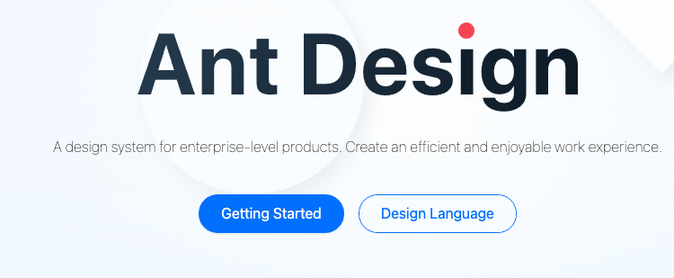
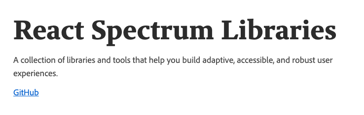

## 읽기 목록

### 폰트

[Adobe Spectrum](https://spectrum.adobe.com/) 을 따라서 웹페이지를 개발하고 있는데, [Source Han Sans Korean](https://fonts.adobe.com/fonts/source-han-sans-korean#fonts-section) 폰트를 사용하고 싶어서 웹 폰트에 대해서 자료를 조금 찾아봤다.

- [Understanding of Font Formats: TTF, OTF, WOFF, EOT & SVG](https://medium.com/@aitareydesign/understanding-of-font-formats-ttf-otf-woff-eot-svg-e55e00a1ef2#:~:text=WOFF%20is%20basically%20OTF%20or,supported%20by%20all%20major%20browsers.&text=WOFF2%20is%20the%20next%20generation,the%20wide%20support%20of%20WOFF) : 웹 폰트 형식에 대해 각각 설명해준다. 현재 [브라우저 지원 현황](https://caniuse.com/)에 따르면 EOT는 IE에서만, OTF/TTF, WOFF는 범용적, WOFF2는 IE 불가이다. WOFF, WOFF2가 웹 폰트로 최적화되어 있다.

- [CSS-TRICKS - Understanding Web Fonts and Getting the Most Out of Them](https://css-tricks.com/understanding-web-fonts-getting/) : 폰트 형식부터 임베드 방법, 호스팅 방법, 고급 기능, 추가 고려사항 등을 설명한다. Public 레포에 라이센스가 있는 폰트를 올리지 말라는 지침도 알게 되었다. (`.gitignore` 에 추가해야 한다.)

  - [A COMPREHENSIVE GUIDE TO FONT LOADING STRATEGIES](https://www.zachleat.com/web/comprehensive-webfonts/) : 더 나가서 폰트 로딩 UX를 향상시키는 글도 소개하는데, 나중에 읽어봐야겠다.

- [웹 폰트 사용과 최적화의 최근 동향](https://d2.naver.com/helloworld/4969726) : 네이버 D2에서 2018년에 작성된 웹폰트에 대한 글. 특히 한글 폰트에 대한 고려해볼 수 있는 서브셋 폰트를 소개한 부분과 unicode-range 속성 부분이 좋았다.

### 디자인 시스템

- [Introducing React Spectrum](https://medium.com/adobetech/introducing-react-spectrum-2f3dfab45906) : 어도비에서 만든 [React Spectrum](https://github.com/adobe/react-spectrum) 라이브러리에 대한 소개 블로그 글. Adobe-Spectrum이 어도비의 디자인 시스템이라면, React-Spectrum은 디자인 시스템의 리액트 구현체이고, 이는 리액트 훅으로 접근성을 따로 다루는 [React-Aria](https://react-spectrum.adobe.com/react-aria/index.html), 크로스 플랫폼을 다루는 [React-Stately](https://react-spectrum.adobe.com/react-stately/index.html)를 포함한다.
  [Material-UI](https://material-ui.com/)와 [Ant Design](https://ant.design/)이 웹 개발을 빠르고 쉽게 해주는 리액트 컴포넌트 라이브러리, 디자인 시스템이 주요 컨셉인 것과 달리 React-Spectrum은 주요 컨셉으로, 접근성, 크로스 플랫폼(적응성), 국제화까지를 목표로 한다는 점에서 차별점이 있다고 느껴졌고 어도비니까 가능하다고 느껴졌다.

  

  

  

- [Naming Tokens in Design Systems](https://medium.com/eightshapes-llc/naming-tokens-in-design-systems-9e86c7444676) : 디자인 시스템에서의 네이밍에 대해 다룬 글.

  - [Medium - Nathan Curtis](https://medium.com/@nathanacurtis) : 미디엄에 디자인 시스템 관련 양질의 글을 다량으로 작성해주셨다.

### 개발하면서 참고한 자료

- [pointer-events](https://css-tricks.com/almanac/properties/p/pointer-events/) : `pointer-events: none` 으로 마우스 포인터와 관련된 상태들(css의 hover/active, JS의 onClick, onTouch)을 동작하지 않게 할 수 있다.

- [Why React Context is Not a "State Management" Tool](https://blog.isquaredsoftware.com/2021/01/context-redux-differences/) : 리액트 컨텍스트 API와 리덕스의 차이점을 설명한 글. 컨텍스트 API는 의존성 주입의 형태, 상태 수송 메커니즘이지 상태를 "관리"하는 개념이 아니다. 상태 관리는 useState나 useReducer등의 훅으로 하는 것이다.

- [TypeScript: sum of object properties within an array – Expert Code Blog](https://expertcodeblog.wordpress.com/2018/10/31/typescript-sum-of-object-properties/) : TS에서 reduce 함수로 객체 배열의 합을 구하는 방법.

- [How To Write Better Functional Components in React](https://medium.com/better-programming/how-to-write-better-functional-components-in-react-bc974f777145) : 리액트 함수형 컴포넌트를 더 잘 작성하는 5가지 팁.

- [useEffect 완벽 가이드 — Overreacted](https://overreacted.io/ko/a-complete-guide-to-useeffect/) : 리액트에서 데이터 페칭을 할 때 주로 사용하는 useEffect에 대한 완벽 가이드.

- [How to fetch data with React Hooks? - RWieruch](https://www.robinwieruch.de/react-hooks-fetch-data) : 리액트 데이터 페칭의 다양한 패턴들.

- [await vs return vs return await](https://jakearchibald.com/2017/await-vs-return-vs-return-await/) : API 인터페이스를 작성하다가 마주한 [ESLint 룰 no-return-await](https://eslint.org/docs/rules/no-return-await)에 대해 알아보다 찾게 된 글. 비동기 함수를 단순 호출 할 때, await 할 때, 리턴할 때, await를 리턴할 때의 동작을 이해할 수 있었다. eslint 룰에서 설명하는 `return await` 를 사용할 때 생기는 "extra microtask"에 대해서는 이해하지 못했다.

## Github

- [storybook-addon-designs](https://github.com/pocka/storybook-addon-designs) : 스토리북을 Figma와 함께 사용할 때 유용한 애드온.

- [storybook-dark-mode](https://github.com/hipstersmoothie/storybook-dark-mode) : 스토리북에서 다크모드를 사용할 때 유용한 애드온.

- [React Spectrum Libraries](https://github.com/adobe/react-spectrumhttps://github.com/adobe/react-spectrum) : 위에서 소개한 @adobe/react-spectrum

- [git-open](https://github.com/paulirish/git-open) : git remote 레포지토리를 바로 브라우저에서 열어준다.

- [react-if](https://github.com/romac/react-if) : 리액트의 조건부 렌더링을 JSX의 선언적 형태로 작성할 수 있게 도와준다.

### Youtube

- [입사/이작할 스타트업을 고르는 방법 - 취업편](https://www.youtube.com/watch?v=euxI9vljXw8&t=2s) : 구직자로써 스타트업을 고를 때 무슨 기준으로 고를 것인가를 샌드버드 CEO님이 설명해주신다.

- [Why LocalStorage is Vulnerable to XSS](https://www.youtube.com/watch?v=M6N7gEZ-IUQ) : XSS 취약점이 있는 사이트에서, 로컬스토리지에 토큰을 저장한다면 생길 수 있는 XSS 공격 설명.
