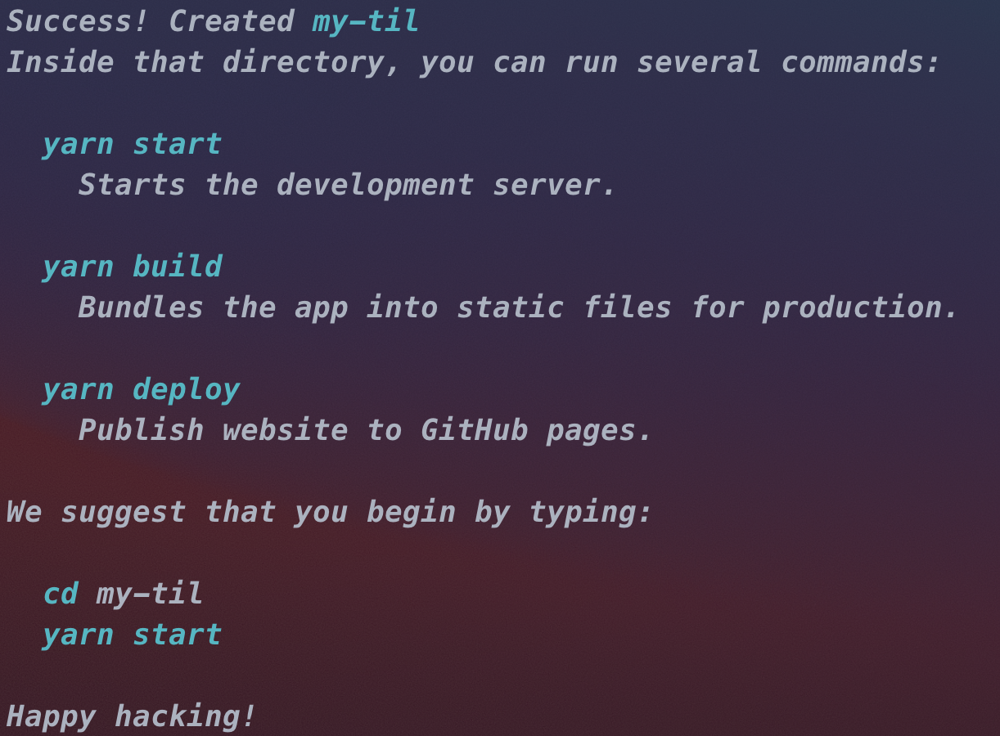
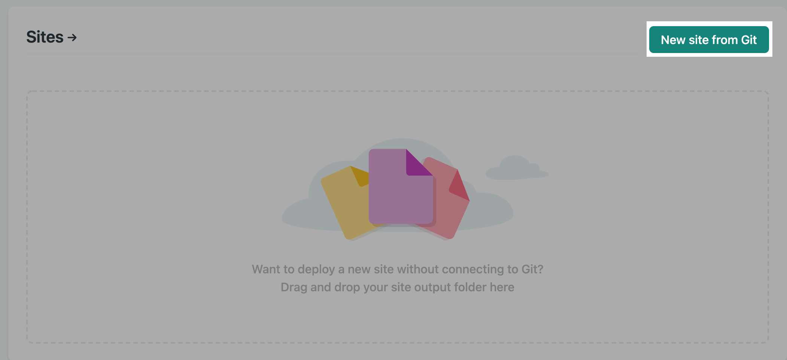
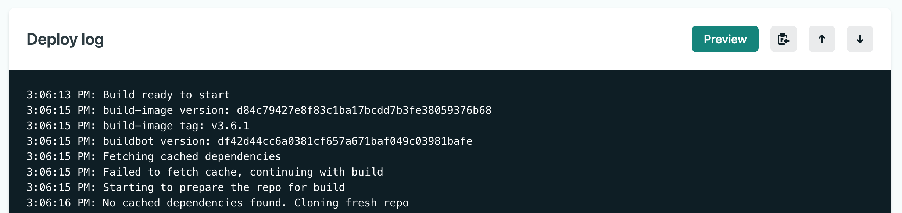

## Docusaurus란?

[Docusaurus](https://github.com/facebook/docusaurus)는 페이스북 오픈소스 커뮤니티에서 관리하는 문서 웹사이트 생성 도구이다.

<div class="Image__Small">
  
  <figcaption>Docusaurus 소개글</figcaption>
</div>

Docusaurus는 Markdown뿐만 아니라 [MDX](https://mdxjs.com/) 형식으로 문서와 블로그 포스트를 쉽게 작성하고, 이를 웹사이트로 퍼블리싱할 수 있다.

리액트 기반으로 이루어져 있으며, [`swizzling`](https://v2.docusaurus.io/docs/using-themes#swizzling-theme-components) 으로 웹페이지를 구성하는 리액트 컴포넌트를 쉽게 커스터마이징 할 수 있다.

기술 문서 도구로서는 문서의 국제화(i18n)와 문서 버저닝이 장점이다. 또한 [Algolia](https://www.algolia.com/) 검색을 붙여서 문서를 검색할 수 있다.

<div class="Image__Small">
  
  <figcaption>Feature 소개</figcaption>
</div>

<div class="Image__Small">
  
  <figcaption>Who is Using Docusaurus?</figcaption>
</div>

Babel, CRA, Jest, Prettier, React Native, Redux 등 프론트엔드 개발 생태계의 주요 오픈소스 라이브러리들이 문서 도구로 사용하고 있어서 이 라이브러리들의 공식 문서를 한번쯤 봤다면, 익숙할 것이다.

<div class="Image__Small">
  
  <figcaption>GitHub의 About에는 v1이 링크되어 있다.</figcaption>
</div>

<div class="Image__Small">
  
  <figcaption>새로 시작하는 사람들에게는 v2를 권장하고 있다.</figcaption>
</div>

[v1](https://docusaurus.io/)과 [v2](https://v2.docusaurus.io/)가 있으며, 깃헙의 About에는 v1의 문서가 링크되어 있지만 새로 시작하는 사람에게는 v2를 권장하고 있다.

## 생성하기

다음의 명령어로 쉽게 생성할 수 있다.

```bash
# npx @docusaurus/init@latest init [name] [template]
npx @docusaurus/init@latest init my-til classic
```

명령어를 실행하고 나면 실행하는 방법을 안내한다.

<div class="Image__Small">
  
  <figcaption>실행 안내</figcaption>
</div>

안내에 따라 생성한 디렉토리로 이동하고, `yarn start` 명령어로 로컬에서 실행해볼 수 있다.

<div class="Image__Small">
  
  <figcaption>Hello World!</figcaption>
</div>

## 폴더 구조

기본 명령어로 생성되는 Docusaurus의 폴더 구조는 다음과 같다.

```plain text
my-til
├── blog
│   ├── 2019-05-28-hola.md
│   ├── 2019-05-29-hello-world.md
│   └── 2020-05-30-welcome.md
├── docs
│   ├── doc1.md
│   ├── doc2.md
│   ├── doc3.md
│   └── mdx.md
├── src
│   ├── css
│   │   └── custom.css
│   └── pages
│       ├── styles.module.css
│       └── index.js
├── static
│   └── img
├── docusaurus.config.js
├── package.json
├── README.md
├── sidebars.js
└── yarn.lock
```

- `/blog/` : 블로그 형식의 마크다운 문서가 저장되는 디렉토리이다.

- `/docs/` : 기본적인 마크다운 문서가 저장되는 디렉토리이다. (사이드바에 나타나는 문서의 순서는 `sidebar.js` 에서 설정할 수 있다.)

- `/src/` : 페이지 설정이나 리액트 컴포넌트의 기능 및 스타일링을 커스터마이징할 수 있는 소스 디렉토리이다.

- `/static/` : 정적인 파일이 위치되는 곳으로, 이곳에 있는 파일들은 빌드시에 `build` 디렉토리로 복사된다. 즉, 배포 후에는 `/img/some-image.jpg` 등으로 static 파일에 접근할 수 있다.

- `/docusaurus.config.js` : docusaurus 사이트의 설정을 하는 파일이다. 테마 설정, preset, plugin 등등을 모두 설정할 수 있다.

- `sidebars.js` : 문서 페이지에 나타나는 사이드 바의 순서를 명시하는 파일이다. 이를 `docusaurus.config.js` 에서 불러와서 `presets` 또는 `plugin` 에 설정하는 방식으로 사용한다.

## 문서

### docs

생성된 `docs` 폴더에 있는 `doc1` 문서를 보면 front matter로 `id` , `title` , `sidebar_label` , `slug` 가 설정되어 있는 것을 볼 수 있다.

<div class="Image__Small">
  
  <figcaption>기본 문서의 front matter</figcaption>
</div>

각 front matter의 의미는 다음과 같다.

- `id` : 각 문서는 고유한 `id` 를 가져야하며 front matter로 직접 설정할 수 있다. 기본적으로 파일 이름이다.

- `title` : 문서의 제목이다.

- `sidebar_label` : 문서가 사이드바에 표시되는 이름이다.

- `slug` : 문서의 url을 커스텀할 수 있다. 기본적으로 파일 이름이다.

<div class="Image__Small">
  
  <figcaption>기본 문서의 결과</figcaption>
</div>

더 많은 front matter 설정과 자세한 설명은 아래 링크에서 볼 수 있다.

[📦 plugin-content-docs | Docusaurus](https://v2.docusaurus.io/docs/next/api/plugins/@docusaurus/plugin-content-docs#markdown-frontmatter)

### blog

Docusaurus는 문서 형식 뿐만 아니라 블로그 포스트 형태로도 문서를 작성할 수 있다.

<div class="Image__Small">
  
  <figcaption>blog 포스트의 front matter</figcaption>
</div>

생성된 `blog` 폴더에 있는 파일을 보면 이름이 `YYYY-MM-DD-{제목}` 형식으로 되어 있는 것을 볼 수 있다. Docusaurus에서는 이 날짜를 인식해서 작성일자를 표시한다.

<div class="Image__Small">
  
  <figcaption>파일 이름의 날짜를 인식해서 작성일자를 표시한다.</figcaption>
</div>

그리고 `author` , `author_title` , `author_url` , `author_image_url` 을 사용해서 작성자의 정보를 추가할 수 있는데, 이는 블로그를 여러 명이 작성하는 경우에 유용하게 사용할 수 있다.

또한 `tags` 를 추가할 수 있는데, 이를 사용한 태그 기반 검색도 지원하다.

<div class="Image__Small">
  
  <figcaption>태그 기반 검색</figcaption>
</div>

더 자세한 front matter 설정 방법은 아래 링크에서 볼 수 있다.

[Blog | Docusaurus](https://v2.docusaurus.io/docs/next/blog#header-options)

## 배포하기

Docusaurus는 GitHub Pages, Netlify, Vercel 등 다양한 방법으로 쉽게 배포할 수 있다. 이 중 GitHub Pages를 이용한 방법과 Netlify를 이용한 방법을 시도해봤다.

GitHub Pages는 무료로 `github.io` 도메인을 사용할 수 있는 장점이 있었지만, 배포 자동화를 위해서는 직접 설정해야 하는 불편함이 있었다.

Netlify는 `github.io` 보다는 덜 익숙하지만 `netlify.app` 도메인을 무료로 제공해주고, 따로 배포 자동화를 설정하지 않아도 자동화할 수 있는 장점이 있었다.

[Deployment | Docusaurus](https://v2.docusaurus.io/docs/deployment)

### GitHub Pages로 배포하기

먼저 GitHub Pages로 배포하기 위해 GitHub에 Public 레포지토리를 생성한다.

<div class="Image__Small">
  
  <figcaption>Public 레포 생성하기</figcaption>
</div>

그리고 로컬에서 `docusaurus.config.js` 파일을 설정한다.

```javascript
module.exports = {
  // ...
  url: 'https://younho9.github.io', // GitHub organization 또는 username + github.io
  baseUrl: '/my-til/', // '/projectName/' 포맷으로 깃헙 레포지토리 이름을 입력한다.
  projectName: 'my-til',
  organizationName: 'younho9', // GitHub organization 또는 username
  // ...
};
```

이 변경사항까지 커밋하고 푸시한 다음, 다음 명령어로 GitHub Pages로 배포할 수 있다.

```bash
# GIT_USER=younho9 yarn deploy
GIT_USER={username} yarn deploy
```

배포에 성공하면 레포지토리의 Environments 탭에 GitHub Pages가 활성 상태로 표시되고, DNS가 연결될 때까지 조금 기다리면 설정한 url(`https://{username}.github.io/{projectName}/`)로 배포된 Docusaurus 앱을 볼 수 있다.

<div class="Image__Small">
  
  <figcaption>활성 상태로 표시되는 GitHub Pages</figcaption>
</div>

<div class="Image__Small">
  
  <figcaption>정상적으로 배포된 페이지</figcaption>
</div>

앞서 언급한 것처럼, 배포를 자동화하기 위해서는 직접 CD를 설정해야 하는데, 이에 대한 내용은 아래의 링크에서 설명해주고 있다.

[Deployment | Docusaurus](https://v2.docusaurus.io/docs/next/deployment#triggering-deployment-with-github-actions)

### Netlify로 배포하기

Netlify 배포를 위해 `docusaurus.config.js` 의 `url` 과 `baseUrl` 설정을 다음과 같이 설정한다. 첫 배포 시에 Netlify 사이트 이름이 정해지지 않았다면, `url` 은 배포 이후에 설정해도 된다.

```javascript
module.exports = {
  url: 'https://{site-name}.netlify.app', // Netlify 사이트 이름을 설정한다.
  baseUrl: '/',
  // ...
};
```

그리고 [Netlify](https://www.netlify.com/)에 가입하고 GitHub과 연결한 후 레포지토리에 대한 Netlify의 엑세스 권한을 허용해줘야 한다.

Netlify에 가입이 완료되었다면, `New site from Git` 버튼을 눌러 이동한다.



그리고 연결할 Git provider로 GitHub을 선택한다.


그리고 배포할 docusaurus 레포지토리에 대한 Netlify의 엑세스 권한을 추가해준다.


배포할 브랜치를 설정해주고,


그리고 빌드 커맨드와 빌드 결과물이 위치할 폴더를 설정한다. 이에 대한 설정 커맨드는 [여기](https://v2.docusaurus.io/docs/deployment#deploying-to-netlify)에 설명되어 있다.(`npm run build` 대신 `yarn build` 를 사용해도 된다.)


Netlify의 Deploy log를 보면서 정상적으로 배포가 완료되는지 확인한다.



배포가 완료되면 자동 생성된 url을 확인할 수 있고 이 url에 접속하면 배포된 Docusaurus 앱을 확인할 수 있다.

<div class="Image__Small">
  
  <figcaption>Netlify에서 생성된 url</figcaption>
</div>

<div class="Image__Small">
  
  <figcaption>정상적으로 배포된 Docusaurus 앱</figcaption>
</div>

Netlify는 자동 배포 설정한 브랜치에 push 이벤트가 발생하면 자동으로 배포를 시작한다. 또한 특정 브랜치를 추가로 배포할 수 있어서 개발 중인 브랜치의 배포 버전을 확인할 때도 유용하다.


또한 자동 생성된 도메인 이름을 유저가 수정해서 원하는 이름으로 커스텀하여 `https://{custom-site-name}.netlify.app` 도메인으로 사용할 수 있고, 다른 호스팅 업체를 통해 도메인을 구입한 후 연결하는 것도 가능하다.

## 마치며...

간단하게 Docusaurus를 알아보고, 설치하는 방법, 문서 설정 및 배포 방법에 대해 살펴봤다.

이전에 TIL 문서를 관리하려는 목적으로 [docsify](https://docsify.js.org/#/) 와 [vuepress](https://vuepress.vuejs.org/) 를 사용해본 경험이 있는데 vue를 다뤄본 경험이 없다보니 vue 기반인 두 문서 도구를 커스터마이징하여 사용하는데에는 불편함이 있었다.

Docusaurus는 리액트 기반이고, MDX를 지원하기 때문에, 리액트에 익숙한 사람에게는 최적의 문서 도구일 듯 하다.

또한 블로그 형태의 글 목록 역시 관리할 수 있기 때문에, 공동 기술 블로그 또는 스터디 문서 도구로 활용하기에도 좋은 도구이다.

다음 글에서는 간단한 테마 커스터마이징 방법, [Utterance](https://utteranc.es/) 소셜 댓글 추가 방법, [Algolia](https://www.algolia.com/) 문서 검색 연결 방법 등을 다뤄보겠다.
