이전 글에서는 Docusaurus를 간단히 알아보고, 설치 방법, 문서 설정 및 배포 방법을 알아봤다.

이번 글에서는 간단한 테마 커스터마이징 방법, 사이드바 관리 방법, [Utterance](https://utteranc.es/) 를 이용한 소셜 댓글 추가 방법, [Algolia](https://www.algolia.com/) 문서 검색을 연결하는 방법, PWA 설정 방법 등을 다뤄보겠다.

## 테마 커스터마이징

Docusaurus는 **"Little to learn"**, **"Intuitive"** 라는 [디자인 원칙](https://v2.docusaurus.io/docs/next/design-principles)에 따라 직관적이고 쉽게 커스텀할 수 있도록 구성되어 있다.

웹페이지를 구성하는 Navbar, Footer, CodeBlock 등에 대한 설정이 `docusaurus.config.js` 파일으로 추상화되어 있어서 코드를 건드리지 않고도 쉽게 설정할 수 있다.

### CodeBlock

Docusaurus는 [Prism React Renderer](https://github.com/FormidableLabs/prism-react-renderer) 를 사용해서 코드 블럭을 하이라이팅 한다. 기본적으로는 Palenight를 사용하는데, [사용가능한 테마 목록](https://github.com/FormidableLabs/prism-react-renderer/tree/master/src/themes)을 참고하여 설정하면 된다.

라이트모드일 때 사용할 테마와 다크모드일 때 사용할 테마를 개별적으로 설정할 수 있다.

`docusaurus.config.js`

```javascript
module.exports = {
  // ...
  themeConfig: {
    prism: {
      theme: require('prism-react-renderer/themes/github'),
      darkTheme: require('prism-react-renderer/themes/dracula'),
    },
    // ...
  },
};
```

### Navbar

<div class="Image__Small">
  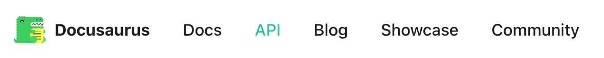
  <figcaption>Docusaurus의 Navbar</figcaption>
</div>

상단에 표시되는 네비게이션 바에는 타이틀과 로고, 네비게이션 아이템들이 있다.

#### title & logo

`docusaurus.config.js`

```javascript
module.exports = {
  // ...
  themeConfig: {
    navbar: {
      title: 'Site Title',
      logo: {
        alt: 'Site Logo',
        src: 'img/logo.svg',
        srcDark: 'img/logo_dark.svg', // Default to `logo.src`.
        href: 'https://v2.docusaurus.io/', // Default to `siteConfig.baseUrl`.
        target: '_self', // By default, this value is calculated based on the `href` attribute (the external link will open in a new tab, all others in the current one).
      },
    },
    // ...
  },
};
```

타이틀과 로고는 직관적으로 알 수 있듯이, 타이틀과 logo의 `src`, `alt`, `href`, `target` 등을 설정하면 된다.

또한 `srcDark` 라는 키로 다크모드일 때의 이미지도 쉽게 설정할 수 있다는 점이 굉장히 친절하다.

#### dropdown

기본 Navbar item을 Dropdown을 사용해 계층적으로 사용하고 싶다면, 다음처럼 쉽게 설정할 수 있다.

`docusaurus.config.js`

```javascript
module.exports = {
  // ...
  themeConfig: {
    navbar: {
      items: [
        {
          label: 'Docs',
          position: 'left', // or 'right'
          items: [
            {
              label: 'Category 1',
              to: '...',
            },
            {
              label: 'Category 2',
              to: '...',
            },
            // ... more items
          ],
        },
      ],
    },
    // ...
  },
};
```

<div class="Image__Small">
  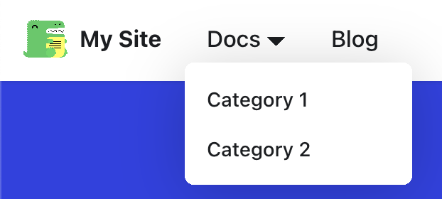
  <figcaption>쉽게 구성할 수 있는 Dropdown item</figcaption>
</div>

## 사이드바 유틸 함수로 만들기

사이드바는 Docusaurus 공식 문서처럼 계층적으로 구성할 수 있다.

<div class="Image__Small">
  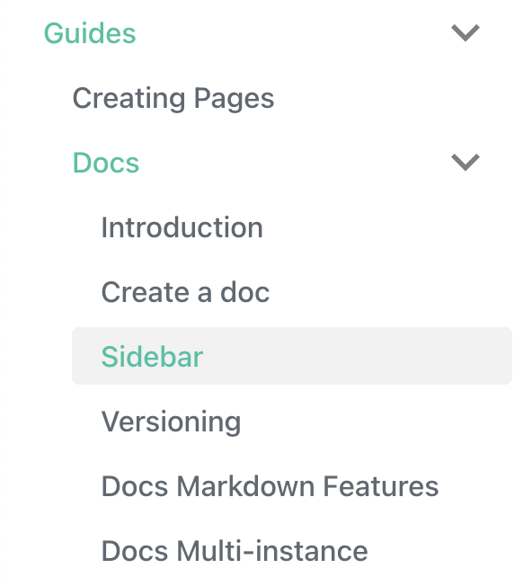
  <figcaption>계층적으로 구성할 수 있는 사이드바</figcaption>
</div>

그런데 사이드바를 구성하기 위해서는 각 문서의 id(파일명)을 직접 추가해주어야 하는데, 문서가 많아지면 일일이 추가하는 것이 번거롭기도 하고, 실수할 수 있기도 하다.

문서가 많거나, 계층 구조가 깊어서 문서를 추가할 때마다 직접 추가하는 것이 번거롭다면, 유틸 함수를 만들어 `sidebar.js` 를 생성하는 것이 편리한 방법이다.

<div class="Image__Small">
  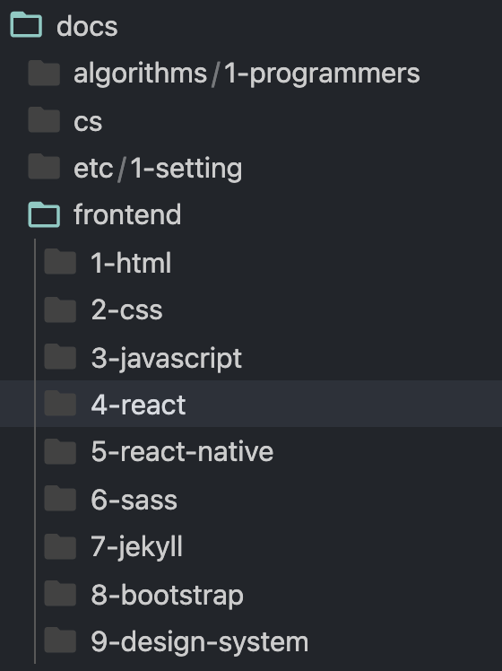
  <figcaption>메인 카테고리와 서브 카테고리로 나눠진 docs</figcaption>
</div>

위의 사진처럼 `docs` 폴더 하위에 메인 카테고리에 더해 서브 카테고리로까지 분류되는 상황이다. 직접 파일 이름 및 계층 구조를 추가해야 한다면 굉장히 번거로울 것이다.

`sidebar.js`

```javascript
// 디렉토리에 있는 파일 이름 배열을 반환함.
const getFilesOf = (dir) =>
  fs
    .readdirSync(dir)
    .reduce(
      (files, fileName) =>
        fileName.includes('.') ? [...files, fileName] : files,
      []
    )
    .map((file) => path.parse(file).name);

// 디렉토리에 있는 디렉토리 목록을 반환함.
const getDirectoriesOf = (dir) =>
  fs
    .readdirSync(dir)
    .reduce(
      (dirs, dirName) => (dirName.includes('.') ? dirs : [...dirs, dirName]),
      []
    );

// docs 디렉토리에 있는 카테고리
const categories = getDirectoriesOf('docs');

// 카테고리를 받아서 하위 카테고리의 목록을 반환하는 함수
const getSubCategories = (category) => getDirectoriesOf(`docs/${category}`);

// 서브 카테고리 파일들을 Docusaurus의 중첩된 사이드바로 구성
const createSubCategoryItem = (category, subCategory) => ({
  type: 'category',
  label: SUB_CATEGORY_SLUGS[removePriority(subCategory)],
  items: getFilesOf(`docs/${category}/${subCategory}`).map(
    (fileName) => `${category}/${subCategory}/${fileName}`
  ),
});

// 카테고리 별로 서브 카테고리의 중첩된 사이드바를 구성
module.exports = categories.reduce(
  (sidebars, category) => ({
    ...sidebars,
    [category]: getSubCategories(category).map((subCategory) =>
      createSubCategoryItem(category, subCategory)
    ),
  }),
  {}
);
```

<div class="Image__Small">
  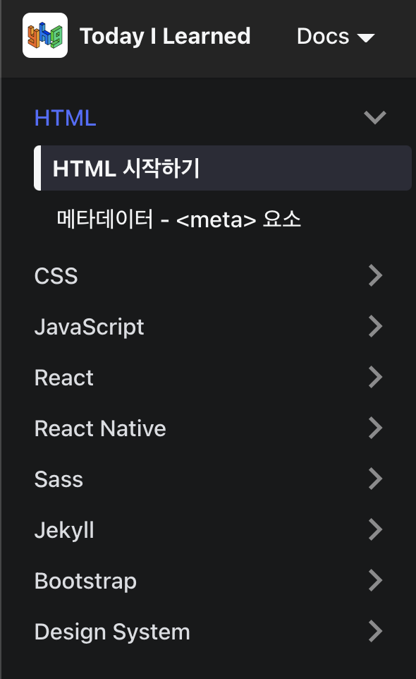
  <figcaption>유틸 함수를 통해 생성한 sidebar</figcaption>
</div>

이 유틸 함수를 이용해 하위 카테고리까지 중첩된 사이드바를 쉽게 구성할 수 있었다.

또한 GitHub Action을 통해 주기마다 문서를 외부 소스와 동기화하고 있는데, `sidebar.js` 파일에 직접 추가해주지 않아도 되기 때문에 자동화할 수 있었다.

## Utterances 연결하기

오픈소스 기술 문서의 경우에는 불필요할 수 있지만, TIL이나, 공동 블로그 등의 학습 목적으로 Docusaurus를 사용할 때, 댓글 기능이 필요할 수 있다.

소셜 댓글 플러그인으로는 [Disqus](https://disqus.com/)와 [Utterances](https://utteranc.es/)가 대표적인데, 둘 중 Utterances 연결을 적용했다.

Utterances를 적용하기 위해서는 먼저 Github 레포가 public이어야 하고, utterances 앱의 해당 레포지토리 접근을 허용해야 한다.

[Utterances 설정](https://github.com/apps/utterances)

Utterances를 설정하는 방법은 `DocItem` 컴포넌트와 `BlogPostPage` 컴포넌트 최하단에 Utterances 태그를 삽입하는 것인데, 이 컴포넌트들은 Docusaurus 내부에 감춰져있다.

이를 꺼내기 위해서는 [`swizzle`](https://v2.docusaurus.io/docs/next/cli#docusaurus-swizzle) 이라는 커맨드를 사용해야 한다.

```bash
yarn run swizzle @docusaurus/theme-classic DocItem
```

<div class="Image__Small">
  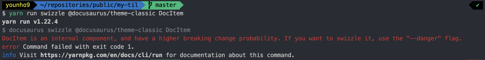
  <figcaption>--danger 플래그를 요구한다.</figcaption>
</div>

이 명령어를 사용하면 `DocItem` 이 내부 컴포넌트이므로 주의를 요하는데, `—danger` 플래그를 사용해야 꺼낼 수 있다고 한다.

변경 가능성이 있으므로 주의하라는 뜻인데, 내부 컴포넌트를 꺼낸 후에도 삭제하면 다시 원래대로 사용할 수 있다.

따라서 앞으로 docusaurus가 업데이트 될 때, 꺼냈던 컴포넌트를 다시 삭제해야할 수 있음을 기억해야 한다.

Utterances만 간단히 추가하기 위해 `—danger` 플래그를 붙여 `DocItem` 과 `BlogPostPage` 를 `swizzle` 한다.

```bash
yarn run swizzle @docusaurus/theme-classic DocItem --danger
yarn run swizzle @docusaurus/theme-classic BlogPostPage --danger
```

명령어를 실행시키고 나면 `src/theme` 디렉토리에 내부 컴포넌트인 `BlogPostPage` 와 `DocItem` 컴포넌트가 생성된 것을 확인할 수 있다.

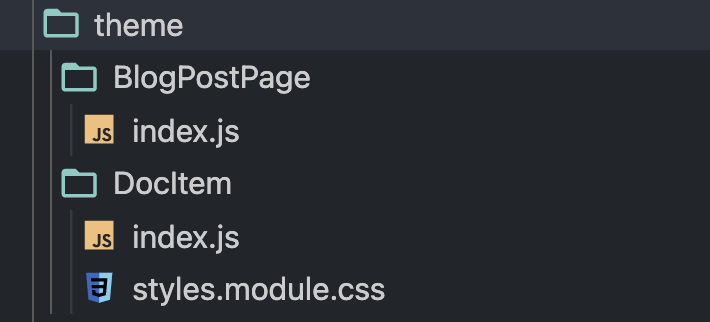

그리고 Utterances를 사용하기 위해 `src` 디렉토리 하위에 `components` 디렉토리를 생성하고, `Comment.js` 파일을 다음과 같이 생성한다.

`src/components/Comment.js`

```javascript
import React, { useEffect, useRef } from 'react';

function Comment() {
  const containerRef = useRef(null);

  useEffect(() => {
    const createUtterancesEl = () => {
      const script = document.createElement('script');

      script.src = 'https://utteranc.es/client.js';
      script.setAttribute('repo', '{username}/{repository name}');
      script.setAttribute('issue-term', 'title');
      script.setAttribute('label', 'comment');
      script.setAttribute('theme', 'github-light');
      script.crossOrigin = 'anonymous';
      script.async = true;

      containerRef.current.appendChild(script);
    };

    createUtterancesEl();
  }, []);

  return <div ref={containerRef} />;
}

export default Comment;
```

`useEffect` 훅에서 utterances 스크립트를 생성하고 `container` 하위로 삽입하는 코드이다.

`issue-term` 은 댓글 추가시 생성되는 깃헙 이슈 이름으로, `pathname` , `url` , `title` 으로 할 수 있는데, `pathname` 과 `url` 은 한글(유니코드)인 경우 깨질 수 있으므로 `title` 을 사용했다.

이제 생성한 `Comment` 컴포넌트를 `DocItem` 과 `BlogPostPage` 컴포넌트의 적절한 위치에 추가해주면 된다.

- `DocItem` - [https://github.com/younho9/TIL/blob/main/src/theme/DocItem/index.js](https://github.com/younho9/TIL/blob/main/src/theme/DocItem/index.js)

- `BlogPostPage` - [https://github.com/younho9/TIL/blob/main/src/theme/BlogPostPage/index.js](https://github.com/younho9/TIL/blob/main/src/theme/BlogPostPage/index.js)

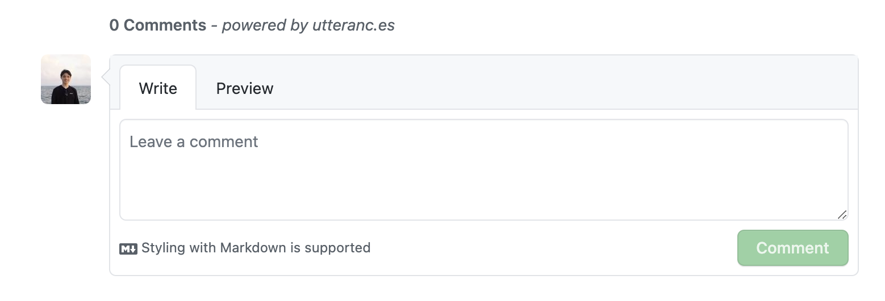

### Utterances에 다크모드 Toggle 적용

위의 `Comment` 컴포넌트는 `github-light` 테마로 고정되어, Docusaurus가 기본적으로 지원하는 다크모드 Toggle 기능이 반영되지 않는다.

이를 반영하기 위해 `Comment.js` 를 다음과 같이 수정한다.

`Comment.js`

```javascript
import React, { useEffect, useRef } from 'react';
import useThemeContext from '@theme/hooks/useThemeContext';

const utterancesSelector = 'iframe.utterances-frame';

function Comment() {
  const { isDarkTheme } = useThemeContext();
  const utterancesTheme = isDarkTheme ? 'github-dark' : 'github-light';
  const containerRef = useRef(null);

  useEffect(() => {
    const utterancesEl = containerRef.current.querySelector(utterancesSelector);

    const createUtterancesEl = () => {
      const script = document.createElement('script');

      script.src = 'https://utteranc.es/client.js';
      script.setAttribute('repo', '{username}/{repository name}');
      script.setAttribute('issue-term', 'title');
      script.setAttribute('label', 'comment');
      script.setAttribute('theme', utterancesTheme);
      script.crossOrigin = 'anonymous';
      script.async = true;

      containerRef.current.appendChild(script);
    };

    const postThemeMessage = () => {
      const message = {
        type: 'set-theme',
        theme: utterancesTheme,
      };

      utterancesEl.contentWindow.postMessage(message, 'https://utteranc.es');
    };

    utterancesEl ? postThemeMessage() : createUtterancesEl();
  }, [utterancesTheme]);

  return <div ref={containerRef} />;
}

export default Comment;
```

Docusaurus는 `useThemeContext` 라는 훅을 제공하여 현재 테마를 가져올 수 있고, 이 테마에 따라 Utterances 스크립트를 마운트한다.

그리고 `utterancesTheme` 변수가 변경된다면, 기존에 마운트되어 있는 Utterances iframe을 찾아서, `postMessage` 로 테마 변경을 전달한다.

<div class="Image__Small">
  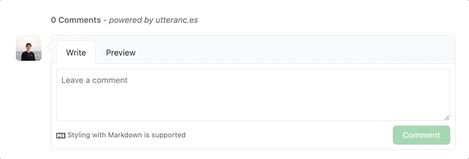
  <figcaption>다크모드 Toggle 적용</figcaption>
</div>

## Algolia 검색 연결하기

[Search | Docusaurus](https://v2.docusaurus.io/docs/next/search)

Docusaurus는 [Algolia DocSearch](https://docsearch.algolia.com/) 와 연결하여 검색 기능을 추가할 수 있다. Algolia DocSearch는 24시간 마다 해당 웹사이트를 크롤링하여 Algolia 인덱스에 저장하고, 해당 웹사이트에서 Algolia API를 사용해서 검색할 수 있도록 한다.

[Who can apply? | DocSearch](https://docsearch.algolia.com/docs/who-can-apply)

Docusaurus 공식 문서는 DocSearch에 지원해서 사용하는 방법을 알려주는데, 이 지원 요청을 승인 받기 위해선 기술 문서여야 하고, 오픈소스여야 한다. 승인 받을 수 있다면, 이를 사용해서 쉽게 Algolia 검색 기능을 추가할 수 있다.

승인되지 않았더라도, 직접 크롤링하여 Algolia 검색 기능을 사용할 수 있는데, 해당 방법이 아래 링크에 설명되어 있다.

[Run your own | DocSearch](https://docsearch.algolia.com/docs/run-your-own/)

### Algolia 설정

먼저 [Algolia](https://www.algolia.com/) 에 회원가입하고, Free를 사용한다.

<div class="Image__Small">
  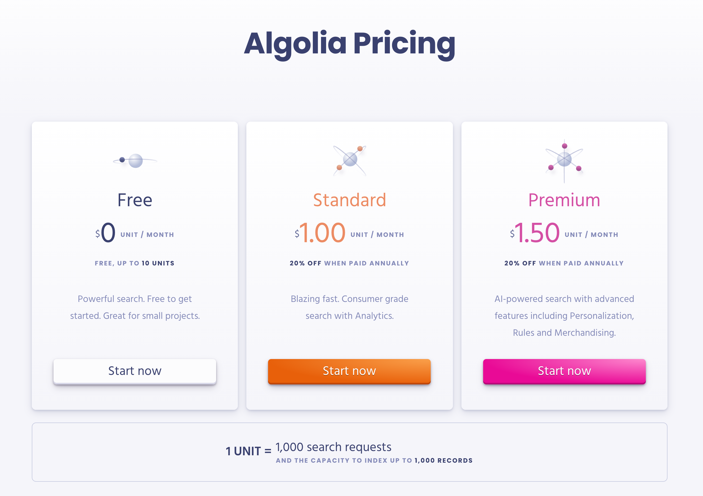
  <figcaption>Free로 생성</figcaption>
</div>

그리고 대시보드의 Indices로 이동하여, index를 생성한다. 지금은 `mytil` 이라는 이름으로 index를 생성했다.

<div class="Image__Small">
  
  <figcaption>Indices에 생성된 mytil index</figcaption>
</div>

그리고 대시보드에서 `API Keys` 로 이동한 뒤에, 다음과 같이 옵션을 설정하여 API Key를 생성한다. ACL에서 `addObject` , `editSettings` , `deleteIndex` 를 추가하는 것에 유의한다. `Indices` 는 비워두어도 된다.

<div class="Image__Small">
  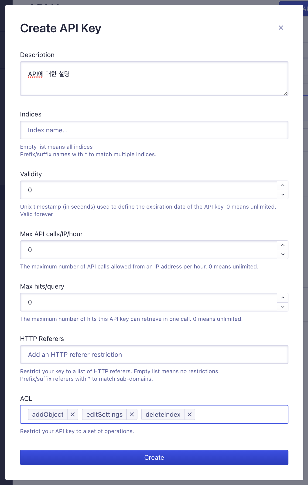
  <figcaption>addObject, editSettings, deleteIndex Operation을 추가해준다.</figcaption>
</div>

### 웹사이트 크롤링

이제 배포된 Docusaurus 앱을 docker 이미지를 통해 크롤링할 것이다.

프로젝트의 루트 디렉토리에 `.env` 파일을 생성하고, Algolia의 Application ID와 생성한 API_KEY의 환경 변수를 세팅한다.

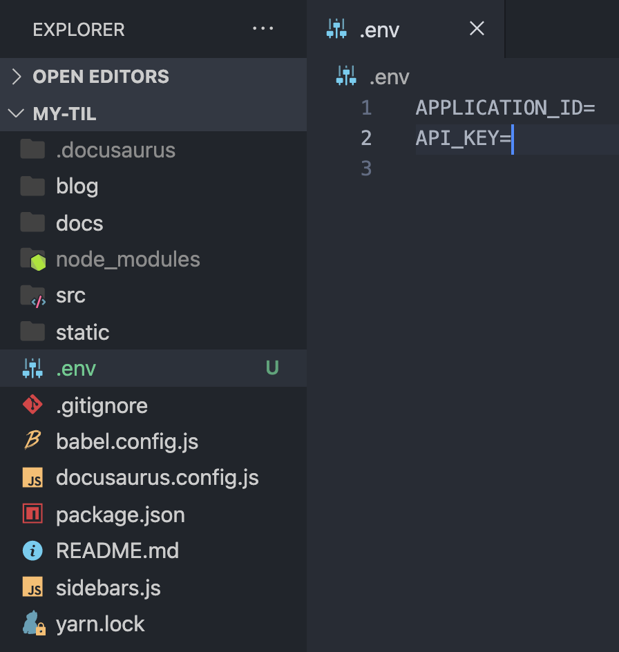

그리고 루트 디렉토리에 `config.json` 파일을 생성하고, 아래 링크로 이동하여 내용을 복사한 후, 붙여넣기한다.

[algolia/docsearch-configs](https://github.com/algolia/docsearch-configs/blob/master/configs/docusaurus-2.json)

`config.json` 파일에서 프로젝트에 맞게 변경해야 할 부분은 `index_name` , `start_urls` , `sitemap_urls` 이다.

- `index_name` 은 Algolia에서 생성한 index의 이름

- `start_urls` 는 배포된 문서의 url

- `sitemap_urls` 는 배포된 문서의 사이트맵의 url

  - 기본적으로 Docusaurus는 루트 경로에 `sitemap.xml` 을 생성해주므로 `{BASE_URL}/sitemap.xml`

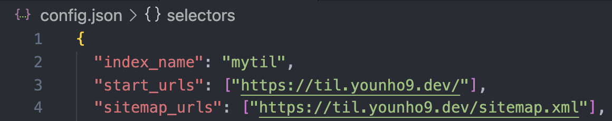

이제 DocSearch 문서의 설명을 따라 Docker 이미지를 사용하여 웹사이트를 크롤링하면 된다.

도커를 설치한 후, 프로젝트 루트 디렉토리에서 다음 명령어를 실행한다.

```bash
docker run -it --env-file=.env -e "CONFIG=$(cat ./config.json | jq -r tostring)" algolia/docsearch-scraper
```

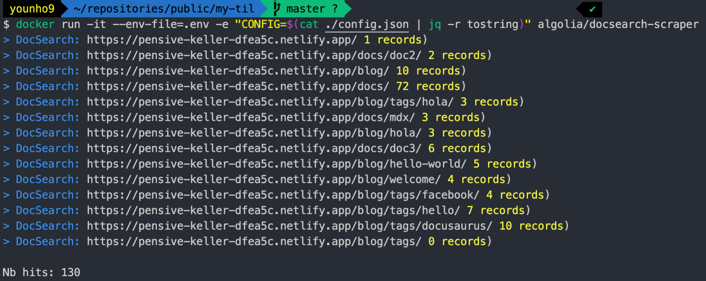

명령어 실행이 성공적으로 되었다면 다음과 같이 표시된다.

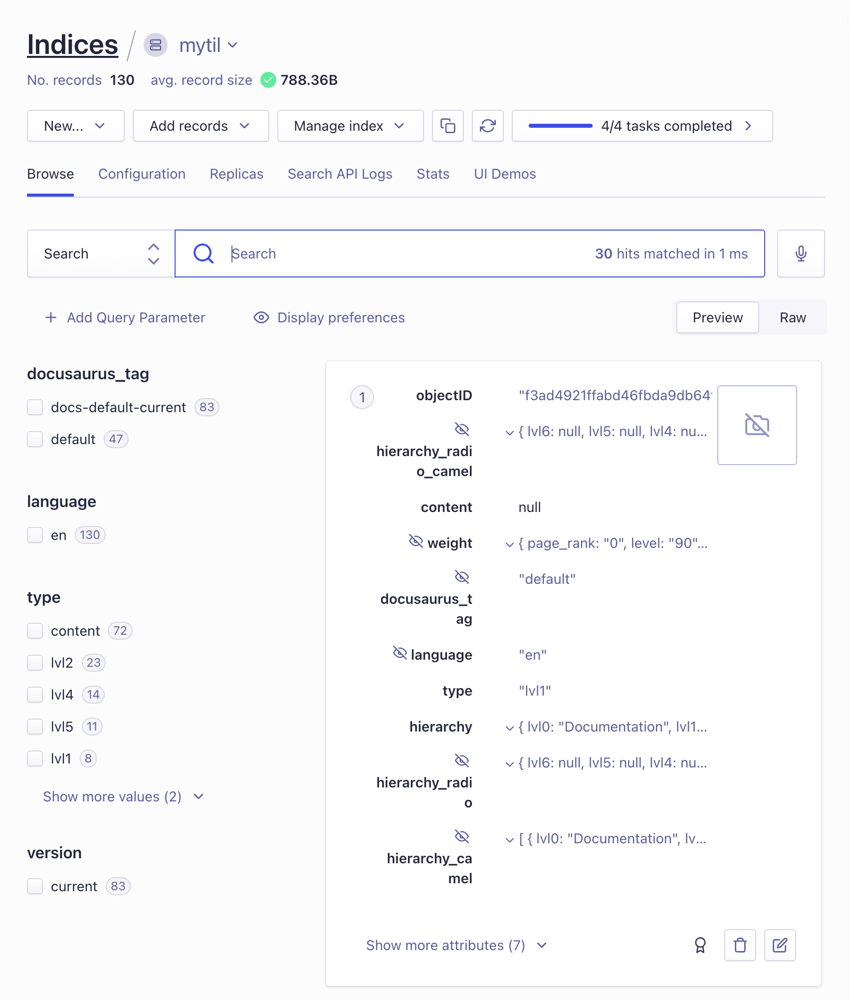

그리고 Algolia의 대시보드로 이동하면, Record가 잘 기록된 것을 볼 수 있다.

그리고 `docusaurus.config.js` 에 Algolia 설정을 추가하면 되는데, 이 때 사용하는 API Key는 생성한 API Key가 아니라 검색 전용 API Key이다.

Application ID와 Search-Only API Key는 클라이언트에서 노출되어도 상관없다. 하지만 admin API Key는 노출되어선 안된다.

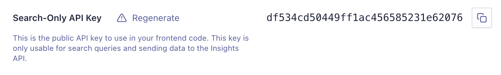

`docusaurus.config.js`

```javascript
module.exports = {
  ...
  themeConfig: {
    algolia: {
      apiKey: 'df534cd50449ff1ac456585231e62076',
      indexName: 'mytil',
      appId: 'CPGK41PHIV',
      contextualSearch: true,
    },
    ...
  }
  ...
}
```

이를 커밋한 후 푸시하여 배포된 사이트에서 검색이 잘 동작하는지 확인할 수 있다.

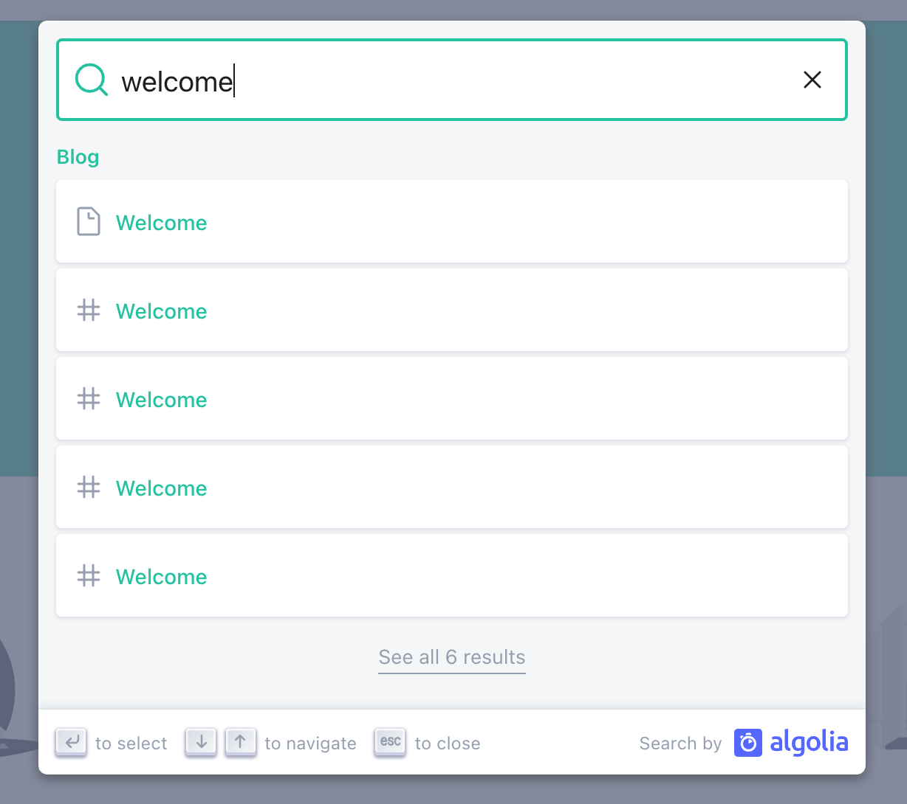

## PWA 설정하기

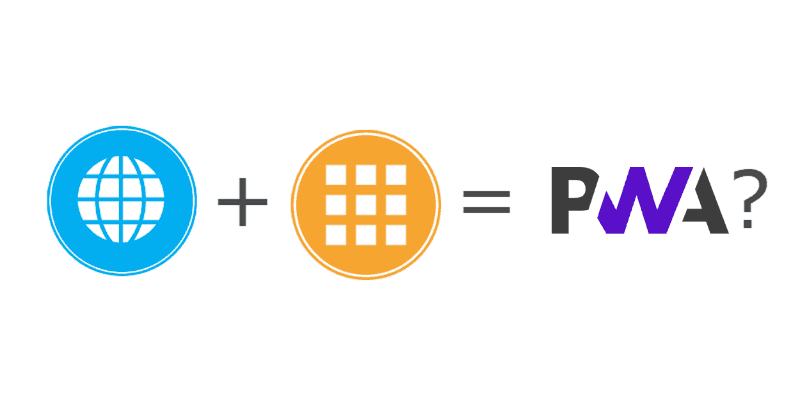

PWA는 Progressive Web App의 약자로, 웹페이지를 앱처럼 사용할 수 있는 기술이다.

Docusaurus는 PWA Plugin으로 쉽게 문서를 PWA로 구현할 수 있다.

다음의 명령어로 plugin-pwa를 설치한다.

```bash
yarn add @docusaurus/plugin-pwa
```

`./static/manifest.json` 파일을 생성한다.

```json
{
  "name": "younho9 TIL",
  "short_name": "📝 TIL",
  "theme_color": "#5468ff",
  "background_color": "#424242",
  "display": "standalone",
  "scope": "./",
  "start_url": "./index.html",
  "icons": [
    {
      "src": "img/icons/icon-72x72.png",
      "sizes": "72x72",
      "type": "image/png"
    },
    {
      "src": "img/icons/icon-96x96.png",
      "sizes": "96x96",
      "type": "image/png"
    },
    {
      "src": "img/icons/icon-128x128.png",
      "sizes": "128x128",
      "type": "image/png"
    },
    {
      "src": "img/icons/icon-144x144.png",
      "sizes": "144x144",
      "type": "image/png"
    },
    {
      "src": "img/icons/icon-152x152.png",
      "sizes": "152x152",
      "type": "image/png"
    },
    {
      "src": "img/icons/icon-192x192.png",
      "sizes": "192x192",
      "type": "image/png"
    },
    {
      "src": "img/icons/icon-384x384.png",
      "sizes": "384x384",
      "type": "image/png"
    },
    {
      "src": "img/icons/icon-512x512.png",
      "sizes": "512x512",
      "type": "image/png"
    }
  ]
}
```

또한 `manifest.json` 에서 설정한 `./static/img/icons` 경로에는 icon을 사이즈별로 생성해주면 되는데 이 때 [favicon-generator](https://www.favicon-generator.org/) 사이트를 사용하면 편리하다.

그리고 `docusaurus.config.js` 에 `@docusaurus/plugin-pwa` 를 추가한다.

`docusaurus.config.js`

```javascript
plugins: [
  ...[
    '@docusaurus/plugin-pwa',
    {
      debug: true,
      offlineModeActivationStrategies: ['appInstalled', 'queryString'],
      pwaHead: [
        {
          tagName: 'link',
          rel: 'icon',
          href: '/img/logo.png',
        },
        {
          tagName: 'link',
          rel: 'manifest',
          href: '/manifest.json', // your PWA manifest
        },
        {
          tagName: 'meta',
          name: 'theme-color',
          content: 'rgb(84, 104, 255)',
        },
        {
          tagName: 'meta',
          name: 'apple-mobile-web-app-capable',
          content: 'yes',
        },
        {
          tagName: 'meta',
          name: 'apple-mobile-web-app-status-bar-style',
          content: '#000',
        },
        {
          tagName: 'link',
          rel: 'apple-touch-icon',
          href: 'img/logo.png',
        },
        {
          tagName: 'link',
          rel: 'mask-icon',
          href: 'img/logo.svg',
          color: 'rgb(255, 255, 255)',
        },
        {
          tagName: 'meta',
          name: 'msapplication-TileImage',
          content: 'img/logo.png',
        },
        {
          tagName: 'meta',
          name: 'msapplication-TileColor',
          content: '#000',
        },
      ],
    },
  ],
];
```

<div class="Image__Small">
  
  <figcaption>크롬 앱</figcaption>
</div>

<div class="Image__Small">
  
  <figcaption>iOS</figcaption>
</div>

PWA를 설정했다.

## 마치며...

이번 글에서는 간단한 테마 커스터마이징, 유틸 함수를 활용한 사이드바 관리 방법, Utterances 소셜 댓글 추가 방법, Algolia 검색 연결 방법, PWA 설정 등을 다루었다.

테마 설정, Algolia 검색 연결, PWA 설정 등 Docusaurus가 지원하는 기능에 대해서는 추상화가 잘 되어 있어서 플러그인처럼 쉽게 붙일 수 있었다.

또한 Utterances 소셜 댓글처럼 Docusaurus가 지원하지 않는 기능이라도, `swizzle` 커맨드를 통해 쉽게 리액트 컴포넌트를 추출하여 커스텀할 수 있었다.

리액트에 익숙하고, 기술 문서를 관리한다면 Docusaurus를 통해 웹페이지를 생성해보자.

## 참고자료

- [https://www.coderhackers.com/blog/2020/02/29/how-to-add-forum-to-docusaurus/](https://www.coderhackers.com/blog/2020/02/29/how-to-add-forum-to-docusaurus/)

- [https://www.youtube.com/watch?v=xXwvDVGBlqQ](https://www.youtube.com/watch?v=xXwvDVGBlqQ)
