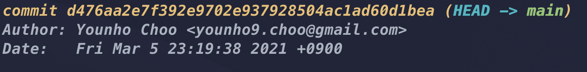
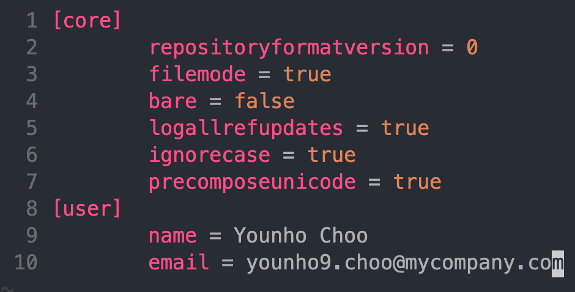
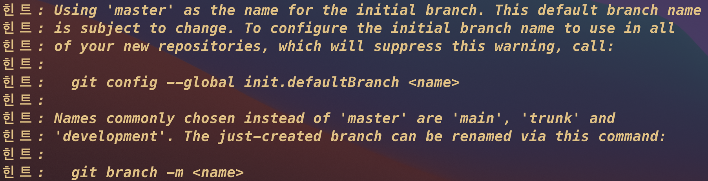
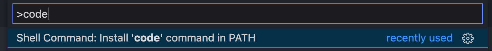
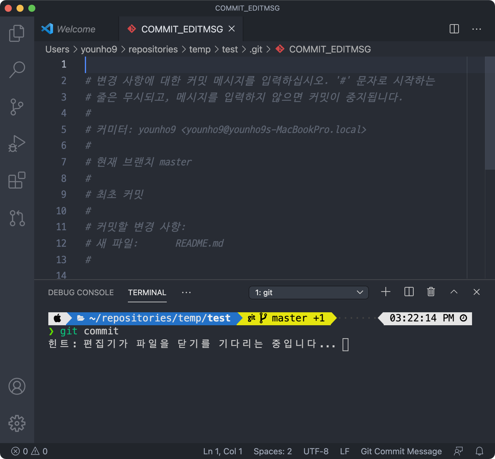
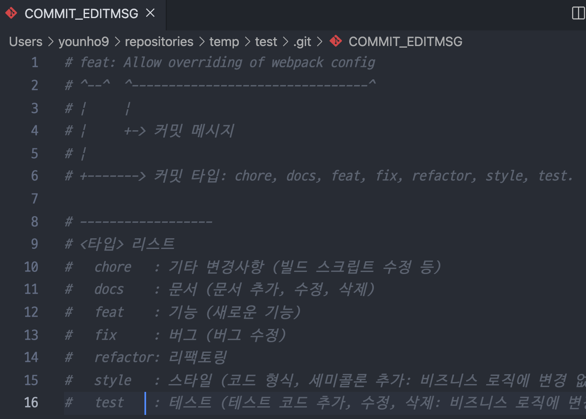
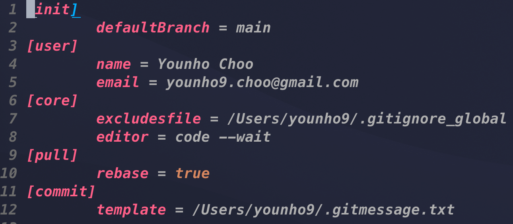

새로 사용하게 된 맥북 초기 설정을 하면서 Git 설정을 하게 되었고, 이 기회에 사용하고 있는 Git config 옵션에 대해 간단히 살펴보고 정리해두기로 했다.

## git username & email

git을 처음 사용하면, 커밋을 누가 작성했는지 표시하기 위해 `username` 과 `email` 을 설정해야 한다.

다음의 명령어로 전역에서 사용될 `username` 과 `email` 을 설정할 수 있다.

```bash
git config --global user.name "Younho Choo"
git config --global user.email younho9.choo@google.com
```

이렇게 설정하고 나면, commit을 작성할 때 해당 `username` 과 `email` 로 커밋이 기록되는 것을 볼 수 있다.



그런데 한 컴퓨터 내에 개인 계정으로 관리하는 레포지토리와 회사 계정으로 관리하는 레포지토리가 모두 있다면 어떻게 해야할까?

`git config —global` 은 git의 전역 설정이고, 레포지토리마다 각각의 config을 관리하는 것이 가능하다. 따라서 전역 설정으로 사용할 `username` 과 `email` 을 등록해놓고, 다른 계정으로 관리하는 레포지토리 내에서 git config을 설정하면, 매번 `global` 설정을 변경하지 않고, 여러 계정으로 git 레포지토리를 관리할 수 있다.

```bash
# 특정 레포지토리 내의 config
git config user.name "Younho Choo"
git config user.email younho9.choo@mycompany.com
```

참고로 이렇게 설정한 레포지토리 내의 config은 `.git/config` 에서 확인할 수 있다.



## git version

MacOS에는 기본적으로 git이 설치되어 있다.

```bash
git --version
git version 2.24.3 (Apple Git-128)
```

Git 공식 홈페이지에서 최신 버전을 확인하고, 최신 버전이 아니라면 git을 업그레이드 해주자.

[Git](https://git-scm.com/)

git을 업그레이드 하기 위해서 brew로 git을 설치한다.

> brew 설치 방법은 [이 링크](https://brew.sh/)에서 확인할 수 있다.

```bash
brew install git
```

brew 설치 후 `git —version` 으로 버전을 확인했을 때, 최신 버전이 표시된다면, 모든 설정이 완료된 것이다.

하지만, 이전에 표시된 MacOS의 기본 버전이 표시된다면 다음의 명령어를 사용한다.

```bash
export PATH=/usr/local/bin:$PATH
```

## git defaultBranch

git 최신 버전으로 업데이트한 후에 임의의 폴더에서 git init을 해보면 경고 메시지가 나타난다.



git의 기본 브랜치명인 `master` 이름에 대한 논란이 있고, 이를 반영하여 `main` 또는 `trunk` 를 사용하길 권장한다. GitHub은 `main` 을 기본 브랜치명으로 사용하기로 결정했다. ( `trunk` 는 나무 줄기, `branch` 는 나뭇가지라는 의미로 사용된다고 한다.)

[github/renaming](https://github.com/github/renaming)

경고 메시지에 따라 기본 브랜치 이름을 설정한다. `main` 이라는 이름을 기본 브랜치명으로 사용하기로 했다.

```bash
git config --global init.defaultBranch main
```

## git default editor

프론트엔드 개발을 주로 하면서 VS Code를 주로 사용하고, git을 사용할 때 VS Code의 내장 터미널을 주로 사용한다.

git의 기본 에디터는 vi로 설정되어 있는데, vi 보다 Code 에디터가 익숙하기 때문에, Code를 git 에디터로 사용하기로 했다.

먼저 `code` 명령어를 설치한다. VS Code를 실행시키고 `cmd` + `shift` + `P` 로 명령어 팔레트를 실행시키고, `code` 를 검색한 후 `code` 명령어를 설치할 수 있다.



설치가 완료되면 다음의 명령어로 git의 기본 에디터를 `code` 로 변경할 수 있다.

```bash
git config --global core.editor "code --wait"
```

이제 `git commit` 명령어를 사용하면 VS Code를 사용해 커밋 메시지를 작성할 수 있다.



## git commit template

좋은 커밋 메시지를 작성하기 위해 기억해야할 것들을 템플릿에 작성해두고, 커밋할 때마다 참고하여 커밋 메시지를 작성하자.

커밋 템플릿을 작성하는 방법은 공식 문서에서 가이드해주고 있다.

[Git - Git 설정하기](https://git-scm.com/book/ko/v2/Git%EB%A7%9E%EC%B6%A4-Git-%EC%84%A4%EC%A0%95%ED%95%98%EA%B8%B0)

먼저 `~/.gitmessage.txt` 파일을 생성한다. 그리고 자신이 커밋할 때마다 참고할만한 내용을 작성한다.

커밋 타입 종류를 명시해놓고, 간단한 룰들을 적어봤다.

`~/.gitmessage.txt`

```plain text
# feat: Allow overriding of webpack config
# ^--^  ^--------------------------------^
# |     |
# |     +-> 커밋 메시지
# |
# +-------> 커밋 타입: chore, docs, feat, fix, refactor, style, test.

# ------------------
# <타입> 리스트
#   chore   : 기타 변경사항 (빌드 스크립트 수정 등)
#   docs    : 문서 (문서 추가, 수정, 삭제)
#   feat    : 기능 (새로운 기능)
#   fix     : 버그 (버그 수정)
#   refactor: 리팩토링
#   style   : 스타일 (코드 형식, 세미콜론 추가: 비즈니스 로직에 변경 없음)
#   test    : 테스트 (테스트 코드 추가, 수정, 삭제: 비즈니스 로직에 변경 없음)
# ------------------
#     제목 첫 글자를 대문자로
#     제목은 명령문으로
#     제목 끝에 마침표(.) 금지
#     제목은 최대 50 글자
#     제목과 본문을 한 줄 띄워 분리하기
#     본문은 한 줄에 최대 72 글자까지만
#     본문은 "어떻게" 보다 "무엇을", "왜"를 설명한다.
#     본문에 여러줄의 메시지를 작성할 땐 "-"로 구분
# ------------------
```

이렇게 작성한 파일을 커밋 템플릿으로 설정하여 `git commit` 명령이 실행하는 편집기에 이 메시지를 기본으로 넣을 수 있다.

```bash
git config --global commit.template ~/.gitmessage.txt
```



## git pull rebase

`git pull` 을 별도 옵션 없이 실행하면 다음의 경고 문구가 나타난다.

```bash
warning: Pulling without specifying how to reconcile divergent branches is
discouraged. You can squelch this message by running one of the following
commands sometime before your next pull:

git config pull.rebase false  # merge (the default strategy)
git config pull.rebase true   # rebase
git config pull.ff only       # fast-forward only

You can replace "git config" with "git config --global" to set a default
preference for all repositories. You can also pass --rebase, --no-rebase,
or --ff-only on the command line to override the configured default per
invocation.
```

이 경고 문구에서 설명하듯이, git pull 전략은 3가지로 다음과 같다.

- default (merge) : 로컬 브랜치와 리모트 브랜치의 Head가 다른 위치에 있을 때, `pull` 받으면, Merge 커밋을 생성함.

- rebase : 로컬 브랜치와 리모트 브랜치의 Head가 다른 위치에 있을 때, `pull` 받으면, 리모트 브랜치를 `rebase` 하여 history를 정리함.

- fast-forward only : fast-forward 관계에 있을 때만 `pull` 을 허용함.

`rebase` 를 사용하면, `git pull` 을 사용할 때 커밋 히스토리를 깔끔하게 관리할 수 있기 때문에, `rebase` 로 설정했다.

다음의 명령어로 설정할 수 있다.

```bash
git config --global pull.rebase true
```

## global .gitignore

`.gitignore` 는 프로젝트에서 중요한 설정 중 하나로, 응용 프로그램 자체에서 생성한 파일이나 디렉토리를 나열해야 한다. 가장 좋은 예는 캐시 파일, 로그, 로컬 구성 등이다.

따라서 `.vscode` , `.idea` , `.DS_Store` 등은 프로젝트의 `.gitignore` 보다 컴퓨터의 글로벌 `.gitignore` 에 추가하는 것이 좋다.

글로벌 `.gitignore` 로 설정하면, 개별 저장소마다 `.DS_Store` 처럼 불필요한 파일을 `.gitignore` 에 추가할 필요가 없어진다.

프로젝트의 성격 또는 협업을 위해 IDE 설정을 공유할 필요가 있다면, 개별 레포지토리에서 `git add -f` 명령어로 추가하고 커밋하여 버전 관리할 수 있다. (페이스북의 많은 오픈소스들이 `.vscode` 설정을 git으로 관리한다.)

글로벌 `.gitignore` 를 설정하기 위해서 `~/.gitignore_global` 파일을 생성하고 전역에서 무시할 파일을 설정한다.

`~/.gitignore_global`

```bash
*~
.DS_Store
.*.swp

# IDE
.vscode
.idea
```

그리고 다음의 명령어를 사용해서 이 파일을 전역에서 무시하도록 설정한다.

```bash
git config --global core.excludesfile ~/.gitignore_global
```

## 최종 `~/.gitconfig` 파일

위의 설정을 모두 반영한 `.gitconfig` 파일이다.



앞으로 `.gitconfig` , `.gitmessage.txt` , `.gitignore_global` 등의 설정 파일을 관리하고 공유하면, 다른 컴퓨터에서 작업하게 되더라도 쉽게 git을 설정할 수 있을 것 같다.

## 참고자료

[How to upgrade Git to latest version on macOS?](https://stackoverflow.com/questions/8957862/how-to-upgrade-git-to-latest-version-on-macos)

[Git commit message template 만들기](https://ujuc.github.io/2020/02/02/git-commit-message-template-man-deul-gi/)

[좋은 커밋 메시지를 작성하기 위한 커밋 템플릿 만들어보기](https://junwoo45.github.io/2020-02-06-commit_template/)

[Git - git-pull Documentation](https://git-scm.com/docs/git-pull)

[[GIT] Git pull 전략 (default, --ff -only, --rebase)](https://sanghye.tistory.com/43)

[GitHub 환경에서의 실전 Git 레시피 : NHN Cloud Meetup](https://meetup.toast.com/posts/116)

[Don't put .idea and .vscode directories to project's .gitignore](https://blog.martinhujer.cz/dont-put-idea-vscode-directories-to-projects-gitignore/)
