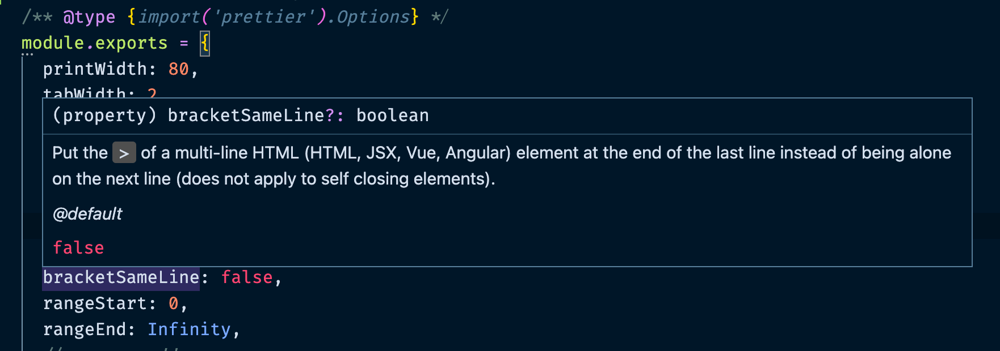

## TL;DR

- 프로젝트마다 프리티어 설정 파일을 개별적으로 만들다보면, 모든 프로젝트를 일관되게 관리하기 어려울 수 있다.
- 설정 파일을 따로 만들어 배포하고 버전 관리하자.
- JSDoc을 사용하면 타입 지원을 받을 수 있다.
- `.prettierignore`를 패키지에 포함시켜 프리티어를 적용하지 않을 파일 목록 또한 공유할 수 있다.

## Intro

JS 생태계에는 수많은 툴들이 있고, 개발자마다 선호하는, 또는 프로젝트에 적합한 툴들이 다양하지만, 프리티어는 설정이 간단하면서도 생산성에 큰 도움이 되기 때문에 많이 사용되고 있는 것 같다.

특히, 개인이 선호하는 설정이나 팀에서 협의한 설정으로 코드 스타일을 일관되게 관리할 수 있다는 점이 큰 장점이다.

그런데 프리티어 설정 파일을 프로젝트마다 개별적으로 생성한다면 어떤 이유로 인해 한 프로젝트에서 설정을 바꾸게 되었을 때 다른 프로젝트와의 일관성이 깨지거나, 많은 프로젝트들의 설정을 한꺼번에 변경해야 해서, 번거로울 수 있다.

## 설정 파일 공유하기

이를 위해서 프리티어는 [설정 파일을 쉽게 공유할 수 있는 방법](https://prettier.io/docs/en/configuration.html#sharing-configurations)을 제공한다.

바로 `package.json`의 `prettier` 필드에 사용할 프리티어 설정 패키지의 이름을 명시하는 것이다.

```json
{
  "name": "my-cool-library",
  "version": "9000.0.1",
  "prettier": "@company/prettier-config",
  "devDependencies": {
    "@company/prettier-config": "1.0.0"
  }
}
```

이렇게 하면, 별도의 프리티어 설정 파일을 프로젝트에 생성하거나 `package.json`에 명시하지 않고도, 패키지에 명시한 프리티어 룰을 적용할 수 있게 된다.

## 프리티어 설정 패키지 만들기

공유할 프리티어 설정 패키지를 만들기 위해 패키지를 생성한다.

`npm init -y`로 `package.json`을 생성하고 패키지에 관한 정보를 기입한다.

```json
// package.json
{
  "name": "@username/prettier-config",
  "version": "1.0.0",
  "description": "",
  "main": "index.js",
  "keywords": [],
  "author": "username",
  "license": "ISC",
  "main": "src/index.js",
  "files": ["src"],
  "dependencies": {
    "@types/prettier": "2.4.1"
  },
  "devDependencies": {
    "prettier": "2.4.0"
  },
  "peerDependencies": {
    "prettier": "*"
  },
  "publishConfig": {
    "access": "public"
  }
}
```

> 각 필드에 대한 자세한 설명은 [npm 공식 문서](https://docs.npmjs.com/cli/v7/configuring-npm/package-json)를 참고

`@username/prettier-config` 처럼 [스코프를 가진 패키지 이름](https://docs.npmjs.com/cli/v7/using-npm/scope)을 사용한다면, public으로 배포하기 위해 `publishConfig: { "access": "public" }`을 추가해준다.

그리고 `main` 필드에 등록한 `index.js` 파일에 프리티어 설정 객체(configuration object)를 export 해준다.

```js
// index.js
/** @type {import('prettier').Options} */
module.exports = {
  printWidth: 80,
  tabWidth: 2,
  useTabs: false,
  semi: true,
  singleQuote: true,
};
```

위의 `package.json`에서 의존성으로 `@types/prettier`를 추가해 주었는데, 이 패키지가 제공하는 프리티어 설정 타입(`Options`)을 JSDoc으로 명시해주면 타입 지원을 받을 수 있어서, 옵션의 역할이 헷갈릴 때, 문서를 찾지 않아도 힌트를 얻을 수 있다.

<div class="Image__Small">
  
  <figcaption>JSDoc을 통한 타입 지원</figcaption>
</div>

이렇게 구성한 패키지를 [`npm publish`](https://docs.npmjs.com/cli/v7/commands/npm-publish) 명령어로 배포한다.

이후 프리티어 설정을 적용할 프로젝트에 프리티어와 배포한 설정 패키지를 설치하고 위에 언급한 방법으로 `package.json`에 명시한다.

```bash
npm install -D prettier @username/prettier-config
```

이렇게 하면, 프로젝트마다 개별 프리티어 설정 파일을 관리하는 것이 아니라, 패키지의 버전으로 관리할 수 있게 되기 때문에, 프로젝트에서 의존성 버전을 업데이트하면서 자연스럽게 프리티어 설정을 일관되게 적용하게 된다.

또한, 커밋 메시지를 잘 작성해두면, 특정 옵션에 대한 변경이 왜 필요했는지 맥락을 한 곳에서 관리하게 되기 때문에, 본인에게 도움이 될 뿐만 아니라, 팀끼리 공유할 때에도 도움이 될 수 있다.

덤으로 프로젝트의 설정 파일 하나를 줄일 수 있는 효과가 있다.

## .prettierignore

아쉽게도 프리티어를 적용하지 않을 파일들을 `.gitignore`와 같은 문법으로 명시할 수 있는 [`.prettierignore`](https://prettier.io/docs/en/ignore.html#ignoring-files-prettierignore)를 `package.json`에 추가하는 기능은 아직 제공되지 않고 있다.

https://github.com/prettier/prettier/issues/3460

그러다보니 프리티어 설정 파일은 공유하지만 `.prettierignore`은 프로젝트마다 따로 만들어야 하는 상황이 발생한다.

eslint 같은 경우는 `ignorePatterns`를 설정 파일에 포함시킬 수 있는 옵션이 있어서, `.eslintignore` 파일 없이도 설정 파일에서 eslint를 적용하지 않을 파일을 명시할 수 있지만, 프리티어에서 설정 파일에 `ignorePatterns` 옵션을 제공해줄 것을 기대하긴 어려워 보인다.

프로젝트 별로 `.prettierignore` 파일을 불필요하게 관리하지 않기 위한 한 가지 방법은, 공유한 설정 패키지에 `.prettierignore`를 포함시키는 것이다.

```json
// package.json
{
  "name": "@username/prettier-config",
  "version": "1.0.0",
  "description": "",
  "main": "index.js",
  "keywords": [],
  "author": "username",
  "license": "ISC",
  "main": "src/index.js",
  "files": [
    "src",
    ".prettierignore" // .prettierignore를 패키지에 포함할 files에 명시한다.
  ],
  "dependencies": {
    "@types/prettier": "2.4.1"
  },
  "devDependencies": {
    "prettier": "2.4.0"
  },
  "peerDependencies": {
    "prettier": "*"
  },
  "publishConfig": {
    "access": "public"
  }
}
```

그리고 이를 사용하는 패키지에서는 CLI와 `format on save`에 대한 추가 설정이 필요하다.

### CLI

CLI 옵션의 [`--ignore-path`](https://prettier.io/docs/en/cli.html#--ignore-path)를 npm 스크립트에 적용한다.

다음과 같이 등록하여 사용하면, 공유된 프리티어 설정의 `.prettierignore`를 사용하게 된다.

```json
// package.json
"scripts": {
  "format": "prettier --write . --ignore-path ./node_modules/@username/prettier-config/.prettierignore"
}
```

[`husky`](https://github.com/typicode/husky)와 [`lint-staged`](https://github.com/okonet/lint-staged) 조합을 사용하는 경우에도 다음과 같이 설정 가능하기 때문에, CI나 커밋 훅으로 인한 원치 않는 포맷팅을 막을 수 있다.

```json
"lint-staged": {
    "*": [
      "prettier --write --ignore-path ./packages/prettier-config/.prettierignore"
    ],
}
```

### format on save

에디터의 format on save 기능을 사용하고 있다면, 기본적으로 루트의 `.prettierignore`을 확인하기 때문에 별도의 설정이 필요하다.

VSCode를 사용하는 경우 레포지토리의 `.vscode/settings.json`에 경로를 명시함으로, 공유한 설정의 `.prettierignore`를 활용할 수 있다.

```json
// .vscode/settings.json
{
  "prettier.ignorePath": "./node_modules/@username/prettier-config/.prettierignore"
}
```

## 예시

- https://github.com/younho9/lib/tree/main/packages/prettier-config
- [lint-staged](https://github.com/younho9/lib/blob/main/package.json#L42)
- [.vscode/settings.json](https://github.com/younho9/lib/blob/main/.vscode/settings.json#L8)

## 참고자료

- https://prettier.io/docs/en/configuration.html#sharing-configurations
