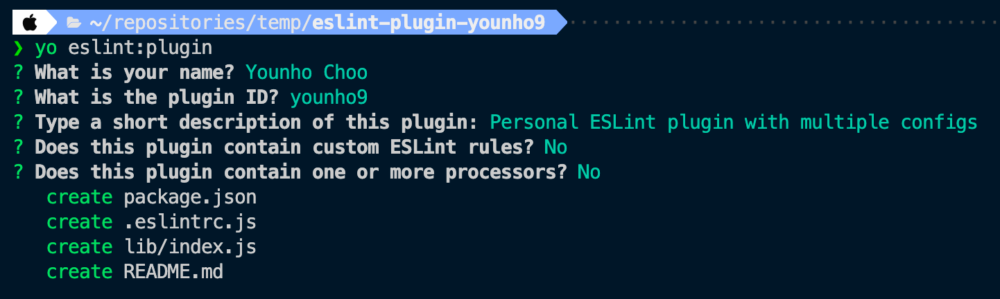

## TL;DR

- ESLint 설정을 공유하기 위해서 `config` 또는 `plugin`을 만들 수 있다.
- **`config`은 설정 만을 포함**할 수 있고, **`plugin`은 설정 뿐만 아니라 자신만의 규칙, 프로세서, 설정 등을 모두 포함**할 수 있다.
- 다양한 플러그인과 설정들을 사용하다보면, 개별 프로젝트에서 관리하기 어려워질 수 있으므로 ESLint 설정 패키지를 따로 만들어 배포하고 관리하자.
- `overrides`를 사용하면 glob 패턴에 따라 환경 별로 사용할 ESLint 설정을 지정할 수 있다.

## Intro

이전 포스트에서 [프리티어 설정을 공유하는 방법](https://younho9.dev/sharing-prettier-config)을 다루었다.

프리티어는 코드의 형식을 지정하는 코드 포맷터(Code Formatter)이고, ESLint는 코드 형식 뿐만 아니라 코드 품질 규칙 등을 포함하는 린터(Linter)이기 때문에, ESLint는 더 많은 설정이 필요하다.

> 참고: [Prettier vs Linters](https://prettier.io/docs/en/comparison.html)

특히, ESLint는 [완전히 플러그 가능한(Pluggable)](https://eslint.org/docs/about/#philosophy), 개발자가 자신만의 린트 규칙을 만들 수 있도록 하는 것을 목표로 만들어졌기 때문에, [생태계에 수많은 플러그인과 규칙들](https://github.com/dustinspecker/awesome-eslint)이 있다.

풍부한 플러그인과 규칙들을 잘 활용하는 것은 개발 효율성과 코드 품질 뿐만 아니라 프로젝트 또는 팀 단위의 스타일 가이드를 확립하는데 많은 도움이 된다.

하지만 이렇게 풍부한 플러그인과 규칙들을 개별 프로젝트마다 관리하는 것은 복잡하기 때문에, 버전 관리나 변경에 대한 컨텍스트를 관리하기 위해 개별 패키지로 관리하는 것이 좋다.

이 글에서는 자신만의 ESLint의 설정(`Config`)을 만드는 법을 다룬다. 자신만의 ESLint 규칙(Rule)을 만드는 법은 다루지 않는다.

## Plugin vs Config

ESLint를 처음 사용할 때 개인적으로 어려웠던 부분은 Plugin과 Config의 차이점을 이해하는 것이었다.

[ESLint Config](https://eslint.org/docs/developer-guide/shareable-configs)은 JavaScript Object로서 일반적인 ESLint 설정 파일(`.eslintrc.{js,cjs,yaml,yml,json}`)을 공유하기 위한 목적으로 만들어진 다음과 같은 네이밍을 가지는 패키지이다.

- `eslint-config-*`
- `@<scope>/eslint-config`
- `@<scope>/eslint-config-*`

[ESLint Plugin](https://eslint.org/docs/developer-guide/working-with-plugins)은 기본적으로 커스텀한 규칙(`Rules`)을 모아서 제공하기 위한 것이지만, 그에 더해 플러그인의 환경(`environments`), 플러그인의 프로세서(`processors`) 그리고 **복수 개의 설정 파일(`Config`)을 포함할 수 있는** 다음과 같은 네이밍을 가지는 패키지이다.

- `eslint-plugin-*`
- `@<scope>/eslint-plugin`
- `@<scope>/eslint-plugin-*`

따라서, ESLint 설정을 공유하기 위해서 `config` 또는 `plugin`을 만들 수 있는데, **`config`은 설정 만을 포함**할 수 있고, **`plugin`은 설정 뿐만 아니라 자신만의 규칙, 프로세서, 설정 등을 모두 포함**할 수 있다.

유용한 ESLint 설정을 모아서 공유하려는 목적이라면, `config`을 만들면 되고, (대표적으로 [`eslint-config-airbnb`](https://www.npmjs.com/package/eslint-config-airbnb)가 있다.) 자신만의 규칙도 만들고 설정도 만들고 싶다면 `plugin`을 만들면 된다. (대표적으로 [`@typescript-eslint/eslint-plugin`](https://www.npmjs.com/package/@typescript-eslint/eslint-plugin)이 있다.)

이 글에서는 `plugin`을 통해 설정을 공유하는 방법을 소개한다.

## generator-eslint

ESLint에서는 [Yeoman generator](https://www.npmjs.com/package/generator-eslint)를 사용하여 플러그인을 생성하는 방법을 가이드한다.

전역으로 yeoman과 generator-eslint를 설치한다.

```bash
npm install -g yo generator-eslint
```

이후 플러그인 패키지 디렉토리를 생성하고, yeoman을 사용하여 플러그인 프로젝트의 스켈레톤을 구성한다.

```bash
mkdir eslint-plugin-younho9
yo eslint:plugin
```



이름과 플러그인 ID, 패키지의 [description](https://docs.npmjs.com/cli/v7/configuring-npm/package-json#description-1)을 입력한다. 이 글에서는 커스텀 규칙이나 프로세서를 작성하는 방법을 다루지 않을 것이기 때문에, No로 응답했다.

## Configs in Plugins

플러그인 내에서 설정 모음(`Config`)을 제공하기 위해서는 export하는 객체에 `configs` 키에 설정들을 내보내면 된다.

다음은 `myConfig`, `myOtherConfig` 이라는 두 설정을 갖고 있는 플러그인을 작성한 예시이다.

```js
// eslint-plugin-myPlugin
module.exports = {
  configs: {
    myConfig: {
      plugins: ['myPlugin'],
      env: ['browser'],
      rules: {
        'semi': 'error',
        'myPlugin/my-rule': 'error',
        'eslint-plugin-myPlugin/another-rule': 'error',
      },
    },
    myOtherConfig: {
      plugins: ['myPlugin'],
      env: ['node'],
      rules: {
        'myPlugin/my-rule': 'off',
        'eslint-plugin-myPlugin/another-rule': 'off',
        'eslint-plugin-myPlugin/yet-another-rule': 'error',
      },
    },
  },
};
```

> 각 설정에 포함할 수 있는 옵션들은 [여기](https://eslint.org/docs/user-guide/configuring/#table-of-contents)에서 볼 수 있다.

## `overrides`를 통해 환경별 처리하기

ESLint 설정에서 까다로운 부분 중 하나는 환경별로 필요한 설정을 잘 관리하는 것이다.

TypeScript와 JavaScript가 공존하는 프로젝트에서 TypeScript에만 적용되어야 하는 규칙이 있을 수 있고, 반대로 JavaScript에만 적용되어야 하는 규칙이 있을 수 있다. (tsdoc, jsdoc 등)

그에 더해, 리액트에 필요한 추가 설정이 있을 수 있고, 테스트 파일에만 필요한 추가 설정이 있을 수도 있다.

이처럼 환경 별로 적용해야 할 ESLint 설정이 많을 수 있는데, 이를 모두 한 설정 파일에서 관리하면, 어떤 설정이 어떤 환경에 필요한 것인지 파악하기 어렵다.

ESLint는 [`overrides`](https://eslint.org/docs/user-guide/configuring/configuration-files#configuration-based-on-glob-patterns) 필드를 제공하여, [glob 패턴](<https://en.wikipedia.org/wiki/Glob_(programming)>)에 따라 기본 설정을 재정의한 설정을 적용할 수 있다.

한 플러그인 내에 여러 설정 파일을 만들 수 있고, 서로 확장할 수 있기 때문에, `javascript`, `javascriptreact`, `typescript`, `typescriptreact`, `jest` 등 환경별 설정 파일을 만들어 관리하고, 각 환경 별 확장명 또는 glob 패턴으로 해당 설정을 `extends` 하게 할 수 있다.

```js
...
overrides: [
  {
    files: ['*.js'],
    extends: ['plugin:younho9/javascript'],
  },
  {
    files: ['*.jsx'],
    extends: ['plugin:younho9/javascript', 'plugin:younho9/react'],
  },
  {
    files: ['*.ts'],
    extends: ['plugin:younho9/typescript'],
  },
  {
    files: ['*.tsx'],
    extends: ['plugin:younho9/typescript', 'plugin:younho9/react'],
  },
  {
    files: ['**/__tests__/**/*.{spec,test}.*'],
    extends: ['plugin:younho9/jest'],
  },
],
...
```

## 마치며 ...

이번 글에서는 Plugin을 통해 ESLint 설정을 만드는 법을 다뤘다.

사실, 커스텀 룰이 없다면 플러그인을 만드는 것보다 config을 만드는 것이 더 적합한 방법일 수 있다. 하지만 언젠가 커스텀 룰을 만들게 되지 않을까 하는 생각으로, Plugin으로 설정 파일을 만들게 되었다.

매번 프로젝트를 시작할 때마다 이전 프로젝트에서 사용하던 ESLint 설정을 복사 + 붙여넣기 했었는데, 이런 방식으로 하다보니 의존하는 플러그인 버전이 달라지면서 설정 방법도 조금씩 달라져 오류가 발생하거나, 환경별로 관리되지 않아, 스택이 다른 프로젝트에 이전에 사용하던 환경에 대한 설정들이 겹쳐 하나의 덩어리 코드가 되기도 했다.

설정 파일을 작성하는 것이 프로그래밍의 영역인지 헷갈리긴 하지만, 설정 파일의 버전과 컨텍스트를 잘 관리하는 것은 개발자의 역할이라고 생각한다.

개별 프로젝트에서 ESLint 설정을 관리하는 것보다 패키지를 만들어 한 곳에서 버전과 컨텍스트를 관리하고, 환경별 설정 파일을 나눠서 관리한다면 ESLint 설정의 복잡성과 피로도를 낮출 수 있을 것이라 생각한다.

## 예시

- https://github.com/younho9/lib/tree/main/packages/eslint-plugin

## 참고자료

- https://eslint.org/docs/developer-guide/shareable-configs
- https://eslint.org/docs/user-guide/configuring/configuration-files#cascading-and-hierarchy
- https://eslint.org/docs/user-guide/configuring/configuration-files#configuration-based-on-glob-patterns
- https://tech.kakao.com/2019/12/05/make-better-use-of-eslint/
